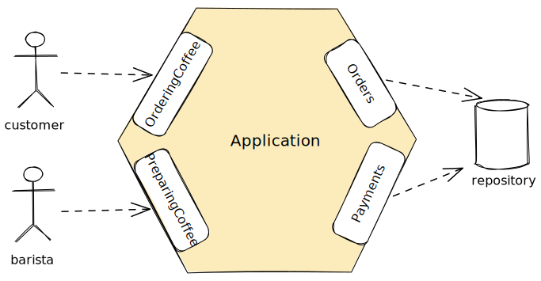
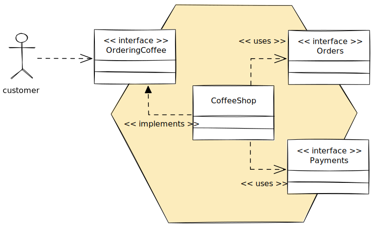
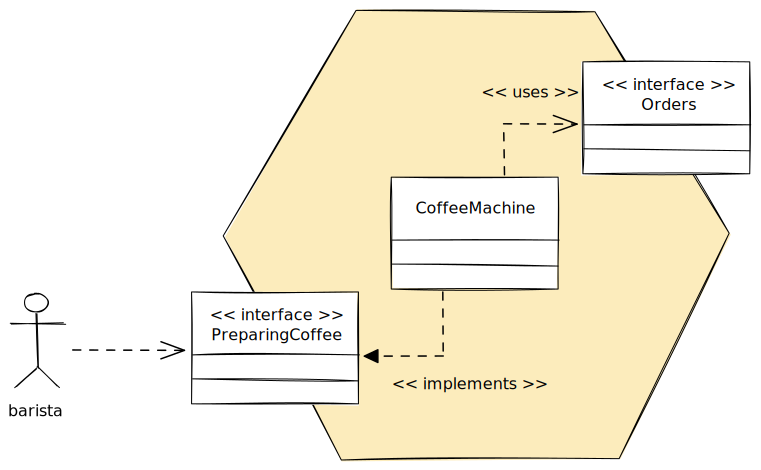
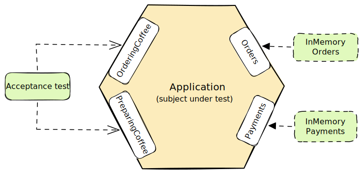
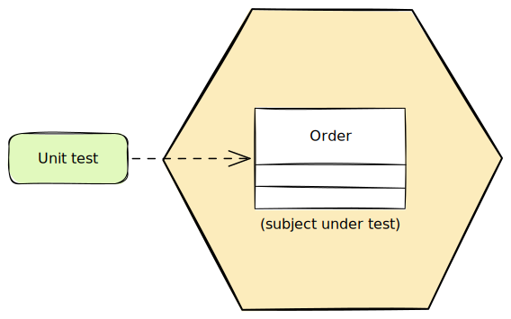
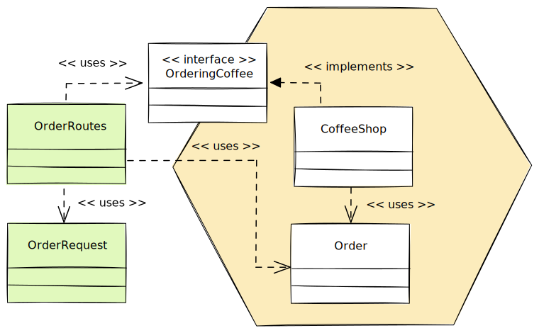
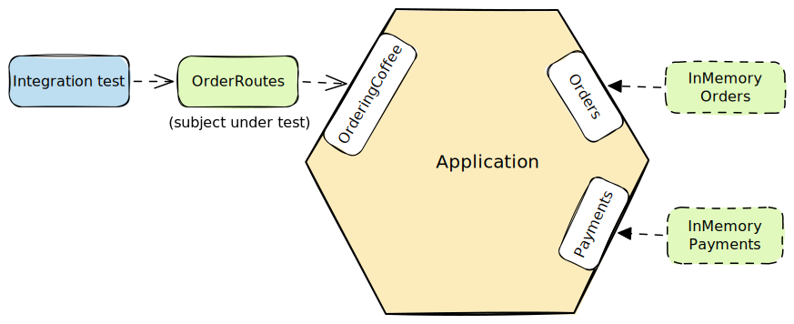
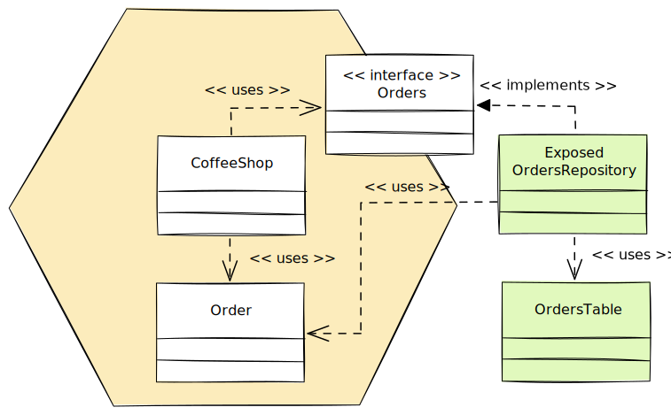
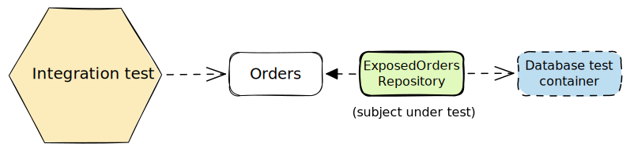
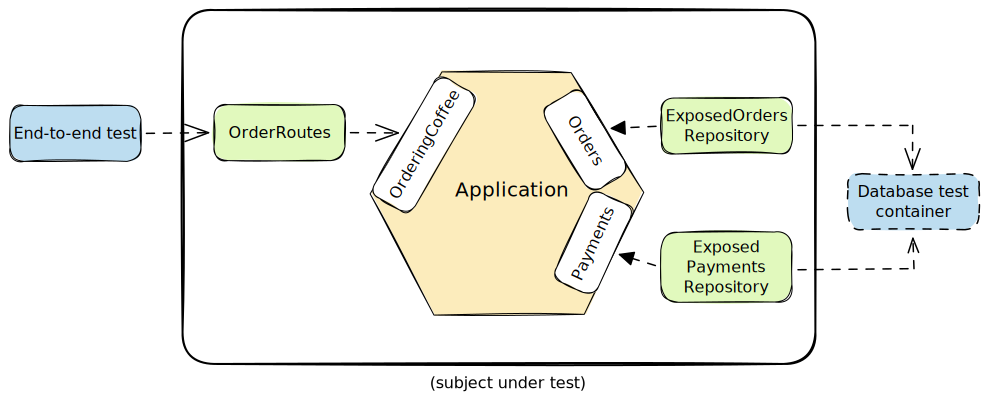

Hexagonal architecture has become a popular architectural pattern for separating business logic from the infrastructure. This separation allows us to delay decisions about technology or easily replace technologies. It also makes it possible to test the business logic in isolation from external systems.

In this article, we will implement hexagonal architecture using Ktor and Exposed. We will use the same coffee shop example as the [Spring Boot implementation](/hexagonal-architecture-spring-boot), so that readers coming from a Spring Boot background can see exactly how the patterns translate.

This article expects a basic understanding of hexagonal architecture. That background is available in the [Hexagonal Architecture Explained](/hexagonal-architecture) article.

## Use Cases and Business Logic

The domain is the same coffee shop from the Spring Boot article. We have two primary ports: `OrderingCoffee` for the customer and `PreparingCoffee` for the barista. There are also two secondary ports for persistence.



```kotlin
interface OrderingCoffee {
    fun placeOrder(location: Location, items: List<LineItem>): Order
    fun updateOrder(orderId: Uuid, location: Location, items: List<LineItem>): Order
    fun cancelOrder(orderId: Uuid)
    fun payOrder(orderId: Uuid, creditCard: CreditCard): Payment
    fun readReceipt(orderId: Uuid): Receipt
    fun takeOrder(orderId: Uuid): Order
}

interface PreparingCoffee {
    fun startPreparingOrder(orderId: Uuid): Order
    fun finishPreparingOrder(orderId: Uuid): Order
}
```

The secondary ports are straightforward.

```kotlin
interface Orders {
    fun save(order: Order): Order
    fun findById(orderId: Uuid): Order
    fun deleteById(orderId: Uuid)
}

interface Payments {
    fun save(payment: Payment): Payment
    fun findByOrderId(orderId: Uuid): Payment
}
```

### Domain Model

In Kotlin, `Order` becomes a data class with a `Status` enum. State transitions return a new copy rather than mutating the object.

```kotlin
data class Order(
    val id: Uuid = Uuid.random(),
    val location: Location,
    val items: List<LineItem>,
    val status: Status = Status.PAYMENT_EXPECTED
) {
    fun cost() = items.map(LineItem::cost).reduce(BigDecimal::add)

    fun markPaid(): Order {
        if (status != Status.PAYMENT_EXPECTED) {
            throw IllegalStateException("Order is already paid")
        }
        return copy(status = Status.PAID)
    }

    fun markBeingPrepared(): Order {
        if (status != Status.PAID) {
            throw IllegalStateException("Order is not paid")
        }
        return copy(status = Status.PREPARING)
    }

    // ...
}
```

`LineItem` similarly computes its cost directly.

```kotlin
data class LineItem(
    val drink: Drink,
    val milk: Milk,
    val size: Size,
    val quantity: Int
) {
    fun cost(): BigDecimal =
        if (size == Size.SMALL) {
            BigDecimal("4.00")
        } else {
            BigDecimal("5.00")
        }.multiply(quantity.toBigDecimal())
}
```

Payment, receipt and credit card are simple Kotlin data classes. In Java, we were using records.

```kotlin
data class Payment(val orderId: Uuid, val creditCard: CreditCard, val paidAt: Instant)
data class Receipt(val amount: BigDecimal, val paidAt: Instant)
data class CreditCard(val cardHolderName: String, val cardNumber: String, val expiry: YearMonth)
```

### Use Case Implementations

`CoffeeShop` implements `OrderingCoffee` and calls the secondary ports `Orders` and `Payments`.



```kotlin
class CoffeeShop(
    private val orders: Orders,
    private val payments: Payments,
    private val transactionScope: TransactionScope = TransactionScope()
) : OrderingCoffee {

    override fun payOrder(orderId: Uuid, creditCard: CreditCard): Payment =
        transactionScope.execute {
            val order = orders.findById(orderId)
            orders.save(order.markPaid())
            payments.save(Payment(orderId, creditCard, Clock.System.now()))
        }

    // ...
}
```

`CoffeeMachine` implements `PreparingCoffee` and only needs the `Orders` port.



```kotlin
class CoffeeMachine(
    private val orders: Orders,
    private val transactionScope: TransactionScope = TransactionScope()
) : PreparingCoffee {

    override fun startPreparingOrder(orderId: Uuid): Order =
        transactionScope.execute {
            val order = orders.findById(orderId)
            orders.save(order.markBeingPrepared())
        }

    // ...
}
```

You will notice `TransactionScope` in both constructors. This is a secondary port defined in the application layer. We will come back to it in the [transactions section](#handling-transactions).

### In-Memory Stubs

We create in-memory implementations of the secondary ports to allow developing the business logic without a database. In Kotlin these are compact.

```kotlin
class InMemoryOrders : Orders {
    private val orders = mutableMapOf<Uuid, Order>()

    override fun save(order: Order): Order {
        orders[order.id] = order
        return order
    }

    override fun findById(orderId: Uuid): Order = orders[orderId] ?: throw OrderNotFound()

    override fun deleteById(orderId: Uuid) {
        orders.remove(orderId) ?: throw OrderNotFound()
    }
}
```

### Acceptance Tests

These tests call the application through the primary ports only, using in-memory stubs for everything behind the secondary ports.



```kotlin
class AcceptanceTests : FunSpec({
    val orders: Orders = InMemoryOrders()
    val payments: Payments = InMemoryPayments()
    val customer: OrderingCoffee = CoffeeShop(orders, payments)
    val barista: PreparingCoffee = CoffeeMachine(orders)

    test("customer can pay the order") {
        val order = orders.save(anOrder())
        val creditCard = aCreditCard()

        val payment = customer.payOrder(order.id, creditCard)

        payment.orderId shouldBe order.id
        payment.creditCard shouldBe creditCard
        orders.findById(order.id).status shouldBe Status.PAID
    }

    test("barista can start preparing the order when it is paid") {
        val existingOrder = orders.save(aPaidOrder())

        val orderInPreparation = barista.startPreparingOrder(existingOrder.id)

        orderInPreparation.status shouldBe Status.PREPARING
    }

    // ...
})
```

These tests are fast because there is no HTTP stack, no database, no application context startup. The Kotest `FunSpec` style lends itself well to this kind of sociable unit test.

### Unit Tests

Some logic is worth testing in isolation. Cost calculation is a good candidate.



```kotlin
class OrderCostTest : FunSpec({
    test("1 small drink costs 4.00") {
        val order = Order(
            location = Location.TAKE_AWAY,
            items = listOf(LineItem(Drink.LATTE, Milk.WHOLE, Size.SMALL, 1))
        )

        order.cost() shouldBe BigDecimal("4.00")
    }

    test("1 large and 1 small drinks costs 9.00") {
        val order = Order(
            location = Location.TAKE_AWAY,
            items = listOf(
                LineItem(Drink.LATTE, Milk.SKIMMED, Size.LARGE, 1),
                LineItem(Drink.ESPRESSO, Milk.SOY, Size.SMALL, 1)
            )
        )

        order.cost() shouldBe BigDecimal("9.00")
    }

    // ...
})
```

## Primary Adapters

There are no controllers in Ktor. Routes are plain functions that receive a `Route` receiver and the ports they need.

```kotlin
fun Route.orderRoutes(orderingCoffee: OrderingCoffee, preparingCoffee: PreparingCoffee) {
    post("/orders") {
        val request = call.receive<OrderRequest>()
        val order = orderingCoffee.placeOrder(request.location, request.domainItems())
        call.response.headers.append(HttpHeaders.Location, "${call.request.uri}/${order.id}")
        call.respond(HttpStatusCode.Created, OrderResponse.fromDomain(order))
    }

    put("/orders/{id}") {
        val request = call.receive<OrderRequest>()
        val order = orderingCoffee.updateOrder(
            Uuid.parse(call.parameters["id"]!!),
            request.location,
            request.domainItems()
        )
        call.respond(HttpStatusCode.OK, OrderResponse.fromDomain(order))
    }

    delete("/orders/{id}") {
        orderingCoffee.cancelOrder(Uuid.parse(call.parameters["id"]!!))
        call.respond(HttpStatusCode.NoContent)
    }

    // ...
}
```

The request and response DTOs handle mapping to and from the domain.



```kotlin
@Serializable
data class OrderRequest(
    val location: Location,
    val items: List<LineItemRequest>,
) {
    fun domainItems() = items.map(LineItemRequest::toDomain)
}

@Serializable
data class OrderResponse(
    val location: Location,
    val items: List<LineItemResponse>,
    @Serializable(with = BigDecimalSerializer::class)
    val cost: BigDecimal
) {
    companion object {
        fun fromDomain(order: Order) =
            OrderResponse(
                order.location,
                order.items.map(LineItemResponse::fromDomain),
                order.cost()
            )
    }
}
```

### Configuring the Application

There is no component scanning, no `@Service` annotation, and no dependency injection framework. We wire the application manually in a `Dependencies` class.

```kotlin
class Dependencies {
    val orders = ExposedOrdersRepository
    val payments = ExposedPaymentsRepository
    val transactionScope = ExposedTransactionScope
    val orderingCoffee = CoffeeShop(orders, payments, transactionScope)
    val preparingCoffee = CoffeeMachine(orders, transactionScope)
}
```

The application module creates the dependencies and passes them into the routing configuration.

```kotlin
fun Application.module() {
    val dependencies = Dependencies()
    configureDatabase(environment.config)
    configureRouting(dependencies)
}

fun Application.configureRouting(dependencies: Dependencies) {
    install(ContentNegotiation) {
        json()
    }
    routing {
        orderRoutes(dependencies.orderingCoffee, dependencies.preparingCoffee)
        paymentRoutes(dependencies.orderingCoffee)
        receiptRoutes(dependencies.orderingCoffee)
    }
    install(StatusPages) {
        exception<OrderNotFound> { call, _ ->
            call.respond(HttpStatusCode.NotFound)
        }
        exception<PaymentNotFound> { call, _ ->
            call.respond(HttpStatusCode.NotFound)
        }
        exception<IllegalStateException> { call, _ ->
            call.respond(HttpStatusCode.Conflict)
        }
    }
}
```

Ktor's `StatusPages` plugin maps exceptions to HTTP responses globally. It is very similar to Spring Boot `@ControllerAdvice` and `@ExceptionHandler` but it's more compact to use. This is where `OrderNotFound` and `PaymentNotFound` — thrown by the secondary ports when an entity is missing — get translated to 404 responses. Business rule violations thrown as `IllegalStateException` map to 409.

> [!note]
> **Spring Boot version**
>
> Used `@Configuration` + `@ComponentScan` with a custom `@UseCase` marker annotation to wire domain classes as Spring beans without polluting the application code with `@Service`.
>
> **Ktor version**
>
> Wiring is a plain class. All dependencies are visible and explicit. There is no annotation scanning, no proxy generation, and no special marker annotations needed.

### Integration Tests for Primary Adapters

Ktor provides a `testApplication` function that sets up the Ktor application in-process without starting a real server. We wire the routes with in-memory stubs, the same approach as the Spring Boot article.



```kotlin
class OrderRoutesTest : FunSpec({
    val orders = InMemoryOrders()
    val payments = InMemoryPayments()
    val orderingCoffee = CoffeeShop(orders, payments)
    val preparingCoffee = CoffeeMachine(orders)

    val orderJson = """
        {
            "location": "IN_STORE",
            "items": [{
                "drink": "LATTE",
                "quantity": 1,
                "milk": "WHOLE",
                "size": "LARGE"
            }]
        }
    """.trimIndent()

    test("create an order") {
        testApplication {  
            application { module() }  
            val client = createClient {  
            install(ContentNegotiation)  
        }
            
        val response = client.post("/orders") {
            contentType(ContentType.Application.Json)
            setBody(orderJson)
        }

        response shouldHaveStatus HttpStatusCode.Created    
    }

    test("update an order") {
        testApplication {  
            application { module() }  
            val client = createClient {  
            install(ContentNegotiation)  
        }

		val order = orders.save(anOrder())

		val response = put("/orders/${order.id}") {
			contentType(ContentType.Application.Json)
			setBody(orderJson)
		}

		response shouldHaveStatus HttpStatusCode.OK
    }

    // ...
})
```

As we can see, there is some boilerplate with the repeated `testApplication` blocks. While there are no test slices in Ktor server tests, we can create our own test slices pretty easily.

```kotlin
class OrderRoutesTest : FunSpec({
    test("create an order") {
        withOrderRoutes {
            val response = post("/orders") {
                contentType(ContentType.Application.Json)
                setBody(orderJson)
            }

            response shouldHaveStatus HttpStatusCode.Created
        }
    }

    test("update an order") {
        withOrderRoutes { orders ->
            val order = orders.save(anOrder())

            val response = put("/orders/${order.id}") {
                contentType(ContentType.Application.Json)
                setBody(orderJson)
            }

            response shouldHaveStatus HttpStatusCode.OK
        }
    }

    // ...
})

fun withOrderRoutes(test: suspend HttpClient.(orders: Orders) -> Unit) {
    val orders = InMemoryOrders()
    val payments = InMemoryPayments()
    val orderingCoffee = CoffeeShop(orders, payments)
    val preparingCoffee = CoffeeMachine(orders)

    testApplication {
        install(ContentNegotiation) {
            json()
        }
        routing {
            orderRoutes(orderingCoffee, preparingCoffee)
        }
        createClient {
            install(ClientContentNegotiation)
        }.use { client -> test(client, orders) }
    }
}
```

We insert objects directly into the in-memory stubs to set up state. There is no mocking framework and no stubbing of method calls. The mapping code is exercised as part of the test, not in isolation.

> [!note]
> **Spring Boot version**
>
> Used `@WebMvcTest` + `MockMvc` + a `@TestConfiguration` that imported `DomainConfig` and provided bean definitions for the in-memory stubs.
>
> **Ktor version**
>
> `testApplication` is a plain function call. There are no test annotations, no application context, and no configuration classes. A small helper function handles the boilerplate of wiring the test application.

## Secondary Adapters

Exposed DSL uses table objects defined as Kotlin `object` declarations. There are no entity annotations and no ORM magic. 

```kotlin
object OrdersTable : Table("orders") {
    val id = uuid("id")
    val location = enumerationByName<Location>("location", 20)
    val status = enumerationByName<Status>("status", 20)
    override val primaryKey = PrimaryKey(id)
}

object OrderItemsTable : Table("order_items") {
    val orderId = uuid("order_id").references(OrdersTable.id)
    val drink = enumerationByName<Drink>("drink", 20)
    val milk = enumerationByName<Milk>("milk", 20)
    val size = enumerationByName<Size>("size", 20)
    val quantity = integer("quantity")
}
```

It is possible to also use Exposed DAO which provides an object-oriented approach for interacting with databases, similar to ORM frameworks.

The repository implements the `Orders` port and handles the mapping between the domain model and the database rows.



```kotlin
object ExposedOrdersRepository : Orders {

    override fun save(order: Order): Order {
        OrdersTable.upsert {
            it[OrdersTable.id] = order.id
            it[OrdersTable.location] = order.location
            it[OrdersTable.status] = order.status
        }

        OrderItemsTable.deleteWhere { OrderItemsTable.orderId eq order.id }
        OrderItemsTable.batchInsert(order.items) { item ->
            this[OrderItemsTable.orderId] = order.id
            this[OrderItemsTable.drink] = item.drink
            this[OrderItemsTable.milk] = item.milk
            this[OrderItemsTable.size] = item.size
            this[OrderItemsTable.quantity] = item.quantity
        }

        return order
    }

    override fun findById(orderId: Uuid): Order {
        val orderRow = OrdersTable.selectAll()
            .where { OrdersTable.id eq orderId }
            .singleOrNull() ?: throw OrderNotFound()

        val items = OrderItemsTable.selectAll()
            .where { OrderItemsTable.orderId eq orderId }
            .map { it.toLineItem() }

        return orderRow.toOrder(items)
    }

    // ...
}

private fun ResultRow.toLineItem() = LineItem(
    drink = this[OrderItemsTable.drink],
    milk = this[OrderItemsTable.milk],
    size = this[OrderItemsTable.size],
    quantity = this[OrderItemsTable.quantity],
)

private fun ResultRow.toOrder(items: List<LineItem>) = Order(
    id = this[OrdersTable.id],
    location = this[OrdersTable.location],
    items = items,
    status = this[OrdersTable.status]
)
```

Exposed's `upsert` handles both insert and update in a single call. Since line items are stored in a separate table, the save strategy is to upsert the order row and then delete and re-insert the items.

The mapping functions are defined as private extension functions on `ResultRow` outside the repository object. This keeps the repository's public interface clean while keeping the mapping code close to where it is used.

> [!note]
> **Spring Boot version**
>
> Used JPA entity classes with `@Entity`, `@OneToMany`, and `@JoinColumn` annotations. The ORM managed the mapping automatically.
>
> **Exposed version**
>
> Table schemas are defined as `Table` classes. There are no persistence annotations. The row mapping is more explicit but there is nothing surprising about it.

## Handling Transactions

In the Spring Boot version, we kept the `@Transactional` annotation out of the application core by using an AOP aspect that targeted any class annotated with `@UseCase`. Ktor has no equivalent mechanism, so we take a different approach.

We define a `TransactionScope` port in the application layer.

```kotlin
interface TransactionScope {
    fun <T> execute(block: () -> T): T

    companion object {
        operator fun invoke(): TransactionScope = NoOp()  
  
        private class NoOp : TransactionScope {  
            override fun <T> execute(block: () -> T): T = block()  
        }
    }
}
```

The companion `invoke()` returns a no-op implementation. This is the default used in tests, so `CoffeeShop(orders, payments)` works without providing a real transaction scope.

In the infrastructure module, `ExposedTransactionScope` wraps Exposed's `transaction { }`.

```kotlin
object ExposedTransactionScope : TransactionScope {
    override fun <T> execute(block: () -> T): T = transaction { block() }
}
```

`CoffeeShop` and `CoffeeMachine` both take a `TransactionScope` as a constructor parameter. Each use case method wraps its work in `transactionScope.execute { }`.

> [!note]
> **Spring Boot version**
>
> A custom AOP aspect intercepted calls to any class annotated with `@UseCase` and wrapped them in a `@Transactional` method. Practical and annotation-free in the application core, but requires Spring's AOP infrastructure, an aspect class, an executor class, and a configuration class.
>
> **Ktor version**
>
> The transaction boundary is modelled as an explicit port. The dependency is visible in the constructor. Tests use the no-op default and never touch a database.

### Integration Tests for Secondary Adapters

We use Testcontainers to spin up a real PostgreSQL database for the repository tests.



```kotlin
class ExposedOrdersRepositoryTest : FunSpec({
    val postgres = install(TestContainerProjectExtension(PostgreSQLContainer<Nothing>("postgres")))

    Database.connect(
        url = postgres.jdbcUrl,
        driver = postgres.driverClassName,
        user = postgres.username,
        password = postgres.password
    )

    transaction {
        SchemaUtils.create(OrdersTable, OrderItemsTable)
    }

    test("creating an order returns the persisted order") {
        val order = Order(
            location = Location.TAKE_AWAY,
            items = listOf(LineItem(Drink.LATTE, Milk.WHOLE, Size.SMALL, 1))
        )

        val persistedOrder = ExposedTransactionScope.execute { ExposedOrdersRepository.save(order) }

        persistedOrder.location shouldBe Location.TAKE_AWAY
        persistedOrder.items shouldContainExactly listOf(LineItem(Drink.LATTE, Milk.WHOLE, Size.SMALL, 1))
    }

    test("finding a placed order returns its details") {
        val orderId = existing(
            Order(
                location = Location.IN_STORE,
                items = listOf(LineItem(Drink.ESPRESSO, Milk.SKIMMED, Size.LARGE, 1))
            )
        )

        val order = ExposedTransactionScope.execute { ExposedOrdersRepository.findById(orderId) }

        order.location shouldBe Location.IN_STORE
        order.items shouldContainExactly listOf(LineItem(Drink.ESPRESSO, Milk.SKIMMED, Size.LARGE, 1))
    }
})

fun existing(order: Order): Uuid {
    ExposedTransactionScope.execute { ExposedOrdersRepository.save(order) }
    return order.id
}
```

Tests call the adapter through the `Orders` secondary port. This exercises the mapping code that translates between the domain model and the database rows, and confirms it round-trips correctly.

> [!note]
> **Spring Boot version**
>
> Used `@DataJpaTest`, which configures only JPA-related beans, requiring an additional `@ComponentScan` to pick up the adapter class.
>
> **Exposed version**
>
> No test annotations, no application context. We configure the database connection directly, create the schema, and call the repository. The test is a plain Kotest spec.

## End-To-End Tests

The end-to-end tests run the full application stack, including Ktor routes, application logic, and Exposed adapters against a real PostgreSQL database.



```kotlin
class CoffeeShopApplicationTests : FunSpec({
    val postgres = install(TestContainerProjectExtension(PostgreSQLContainer<Nothing>("postgres")))

    test("process new order") {
        withTestApplication(postgres) {
            val orderId = placeOrder()
            payOrder(orderId)
            prepareOrder(orderId)
            finishPreparingOrder(orderId)
            readReceipt(orderId)
            takeOrder(orderId)
        }
    }

    test("cancel order before payment") {
        withTestApplication(postgres) {
            val orderId = placeOrder()
            cancelOrder(orderId)
        }
    }
})

fun withTestApplication(postgres: PostgreSQLContainer<Nothing>, test: suspend ApplicationTestBuilder.() -> Unit) {
    testApplication {
        environment {
            config = MapApplicationConfig(
                "database.url" to postgres.jdbcUrl,
                "database.driver" to postgres.driverClassName,
                "database.user" to postgres.username,
                "database.password" to postgres.password,
            )
        }
        application { module() }

        test()
    }
}
```

Each helper method makes a single HTTP call and checks only that the request succeeded. These tests are not repeating the business logic assertions from the acceptance tests. They only verify that the wiring is correct from HTTP request to database and back.

## Structuring the Application

The project has two Gradle modules in `settings.gradle.kts`.

```kotlin
include(":coffeeshop-infrastructure")
include(":coffeeshop-application")
```

The `coffeeshop-application` module contains all the domain and application code. It has no framework dependencies. Its test dependencies are Kotest and nothing else.

```kotlin
dependencies {
    implementation(libs.bundles.kotlinxEcosystem)
    testImplementation(libs.kotestRunnerJUnit5)
}
```

The `coffeeshop-infrastructure` module depends on `coffeeshop-application` and adds Ktor, Exposed, and PostgreSQL.

```kotlin
dependencies {
    implementation(project(":coffeeshop-application"))
    implementation(libs.bundles.exposed)
    implementation(libs.bundles.ktorServer)
    implementation(libs.postgresql)
    // ...
}
```

This enforces the dependency rule at the Gradle level. Any accidental import of infrastructure code from the application module will fail to compile.

Internally, the modules are structured to make the ports and adapters visible.

```text
├── coffeeshop-application
│   └── application
│       ├── ports
│       │   ├── inbound     ← OrderingCoffee, PreparingCoffee
│       │   └── outbound    ← Orders, Payments, TransactionScope
│       ├── domain          ← domain model
│       └── ...             ← CoffeeShop, CoffeeMachine use cases
└── coffeeshop-infrastructure
    ├── adapter
    │   ├── inbound
    │   │   └── rest        ← Ktor routes and DTOs
    │   └── outbound
    │       └── persistence ← Exposed repositories and tables
    └── ...                 ← wiring, database setup
```

## Is It Worth It?

The trade-off analysis from the [Spring Boot article](/hexagonal-architecture-spring-boot#is-it-worth-it) applies here equally. Hexagonal architecture adds cost with separate models and explicit mapping code. That cost only makes sense when the business logic is complex enough to justify the isolation.

One thing that changes with this stack: the Spring Boot version needed a fair amount of ceremony to keep framework code out of the application core. A custom annotation, an AOP aspect, an aspect executor, a `@ComponentScan` configuration. In Ktor, none of that exists. The application core is clean simply because Ktor does not offer any of those mechanisms in the first place.

## Summary

In this article, we implemented hexagonal architecture in a Ktor application using Kotlin and Exposed. The patterns are the same as the Spring Boot version: two Gradle modules enforcing the dependency boundary, ports and adapters separating the application from the infrastructure, and three testing layers covering the domain, adapters, and the full stack.

The main differences from the Spring Boot implementation are how the framework interacts with the pattern, or more accurately, how much less it does. There is no DI container, no annotation scanning, no AOP. Wiring is explicit in a `Dependencies` class. Transactions are modelled as a port.

In the next article, we will improve this implementation to be more idiomatic Kotlin.

You can find the example code on [GitHub](https://github.com/arhohuttunen/hexagonal-architecture-ktor-exposed/tree/baseline).
