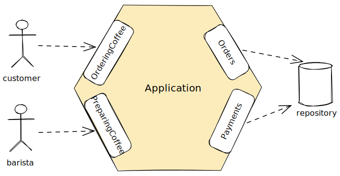
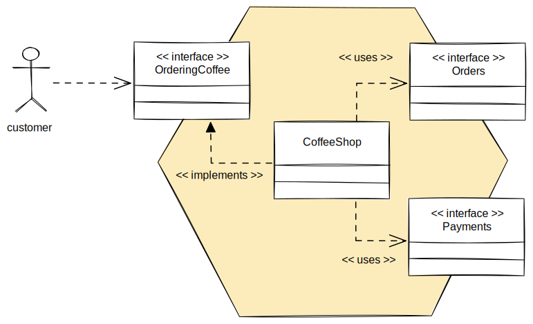
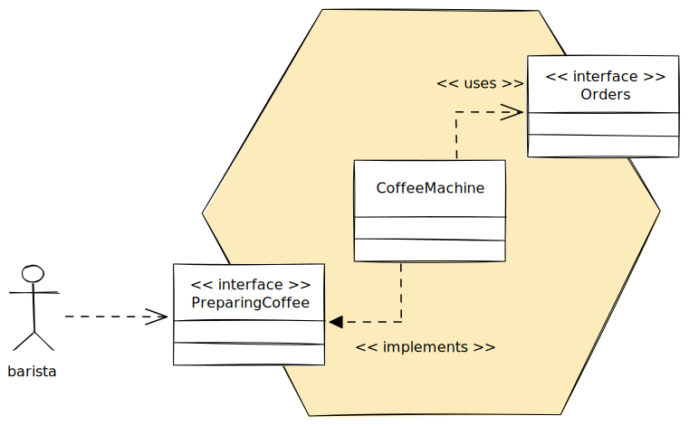
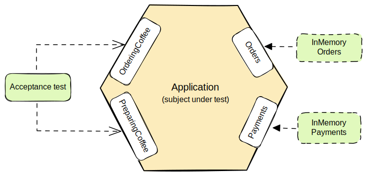
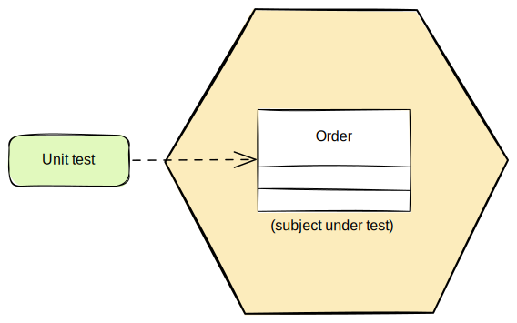
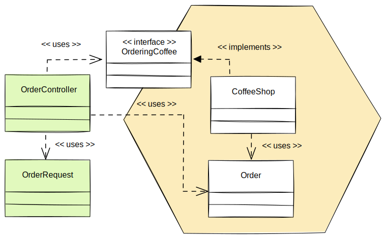
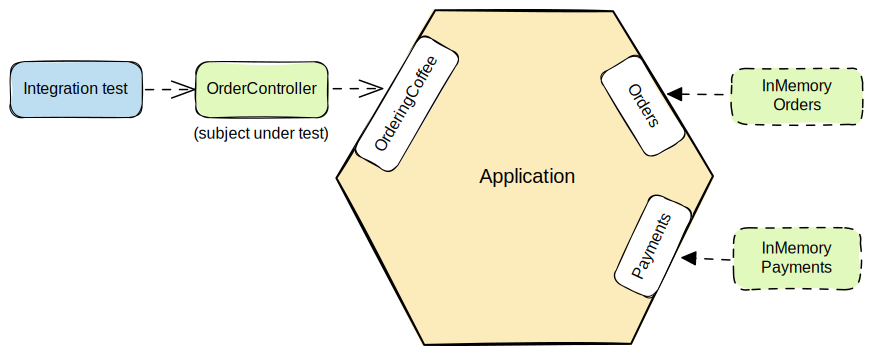
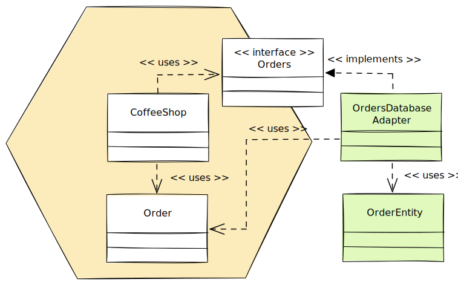
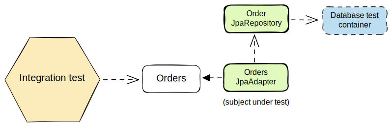
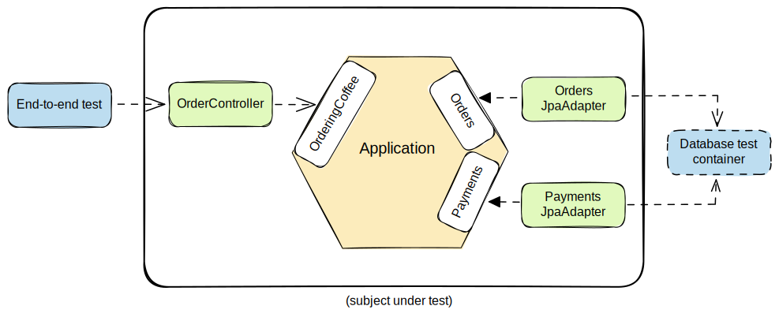

Hexagonal architecture has become a popular architectural pattern for separating business logic from the infrastructure. This separation allows us to delay decisions about technology or easily replace technologies. It also makes it possible to test the business logic in isolation from external systems.

In this article, we will look at how to implement hexagonal architecture in a Spring Boot application. We will separate the business logic and the infrastructure in their own modules and see how we can implement and test these modules in isolation.

This article is a practical hands-on tutorial and expects that the reader has a basic understanding of the principles behind hexagonal architecture. This background information is available in the [Hexagonal Architecture Explained](/hexagonal-architecture) article.

## Use Cases and Business Logic

A core attribute of the hexagonal architecture is that we can implement the business logic separately from the infrastructure. This means that we can start by focusing on the business logic alone.

We are going to start with an example application that allows a customer to order coffee. We have some rules related to making an order and preparing the order.

- The customer can order a coffee and choose the type of coffee, milk, size and whether it's in store or take away.
- The customer can add more items to the order before paying.
- The customer can cancel the order before paying.
- When the order is paid, no changes are allowed.
- The customer can pay for the order with a credit card.
- When the order is paid, the customer can get a receipt.
- When the order is paid, the barista can start preparing the order.
- Once the barista is finished, she can mark the order ready.
- When the order is ready, the customer can take the order, and it's marked taken.

One advantage of the hexagonal architecture is that it can encourage the preferred way of writing use cases. The use cases should live on the boundary of the application, unaware of any external technologies.

We can identify two primary actors: a customer making the order and a barista preparing the order. Knowing that the ports in hexagonal architecture are a natural fit for describing use cases of the application, this leads to introducing two primary ports: `OrderingCoffee` and `PreparingCoffee`. On the other side of the application, we need a couple of secondary ports for storing the orders and payments.



The `OrderingCoffee` and `PreparingCoffee` ports need to fulfill the requirements we have related to making an order and preparing coffee.

```java
public interface OrderingCoffee {
    Order placeOrder(Order order);
    Order updateOrder(UUID orderId, Order order);
    void cancelOrder(UUID orderId);
    Payment payOrder(UUID orderId, CreditCard creditCard);
    Receipt readReceipt(UUID orderId);
    Order takeOrder(UUID orderId);
}

public interface PreparingCoffee {
    Order startPreparingOrder(UUID orderId);
    Order finishPreparingOrder(UUID orderId);
}
```

Similarly, our secondary ports could be called simply `Orders` and `Payments` and their job is to store and fetch orders and payments.

```java
public interface Orders {  
    Order findOrderById(UUID orderId) throws OrderNotFound;
    Order save(Order order);
    void deleteById(UUID orderId);
}

public interface Payments {
    Payment findPaymentByOrderId(UUID orderId);
    Payment save(Payment payment);
}
```

We will need some entities in our domain model. A line item in an order will hold the type of coffee, milk and size of a beverage. We will also need to track the status of the order.

```java
public class Order {  
    private UUID id = UUID.randomUUID();  
    private final Location location;  
    private final List<LineItem> items;  
    private Status status = Status.PAYMENT_EXPECTED;

    // ...
}

public record LineItem(Drink drink, Milk milk, Size size, int quantity) { }

public enum Status {  
    PAYMENT_EXPECTED,  
    PAID,  
    PREPARING,  
    READY,  
    TAKEN  
}
```

There are also classes for payments, credit cards and receipts. In this example, we didn't add any behavior to them, so they are just Java records.

```java
public record Payment(UUID orderId, CreditCard creditCard, LocalDate paid) { }

public record CreditCard(
        String cardHolderName,
        String cardNumber,
        Month expiryMonth,
        Year expiryYear) { }

public record Receipt(BigDecimal amount, LocalDate paid) { }
```

Next, we need to implement the use cases inside our application. We are going to create a `CoffeeShop` class that implements the `OrderingCoffee` primary port. This class will also call the secondary ports `Orders` and `Payments`.



The implementation is pretty straightforward. Here is an example of paying an order that needs both secondary ports.

```java
public class CoffeeShop implements OrderingCoffee {  
    private final Orders orders;  
    private final Payments payments;

    // ...

    @Override  
    public Payment payOrder(UUID orderId, CreditCard creditCard) {  
        var order = orders.findOrderById(orderId);  
  
        orders.save(order.markPaid());  
  
        return payments.save(new Payment(orderId, creditCard, LocalDate.now()));  
    }
```

The role of the `CoffeeShop` class is to orchestrate operations on entities and repositories. It's implementing the primary ports as use cases and using the secondary ports as repositories.

In our implementation, we mostly implemented business logic in domain entities. Here is an example of marking an `Order` paid.

```java
public class Order {  
    // ...

    public Order markPaid() {
        if (status != Status.PAYMENT_EXPECTED) {
            throw new IllegalStateException("Order is already paid");
        }
        status = Status.PAID;
        return this;
    }
}
```

Now for the second use case, we are going to implement a `CoffeeMachine` service class that implements the `PreparingCoffee` primary port.



We could have implemented this functionality in the same class, but we have made a design decision here to split the implementation of different cases in their own classes.

```java
public class CoffeeMachine implements PreparingCoffee {  
    private final Orders orders;  
  
    @Override  
    public Order startPreparingOrder(UUID orderId) {  
        var order = orders.findOrderById(orderId);  
  
        return orders.save(order.markBeingPrepared());  
    }  

    // ...
}
```

Since we want to delay decisions about technologies, we can create stub implementations for the secondary ports we have. The easiest way to do this for repositories is to store the entities in a map.

```java
public class InMemoryOrders implements Orders {
    private final Map<UUID, Order> entities = new HashMap<>();

    @Override
    public Order findOrderById(UUID orderId) {
        var order = entities.get(orderId);
        if (order == null) {
            throw new OrderNotFound();
        }
        return order;
    }  

    @Override
    public Order save(Order order) {
        entities.put(order.getId(), order);
        return order;
    }

    @Override
    public void deleteById(UUID orderId) {
        entities.remove(orderId);
    }
}
```

This allows for implementing the business logic without having to worry about persistence details at this point. In fact, when working iteratively, we could ship the first version of the application with these in-memory stubs.

One thing to note here is that we don’t need interfaces for the primary ports! Having these interfaces available makes it easier to visualize the role of primary ports, but they are unnecessary. We only need interfaces for the secondary ports in order to invert the dependencies there.

Interfaces with a single implementation are useless interfaces. Since our application core is not something that we would replace with another implementation, we could just expose the public methods of the concrete implementation as the primary ports. However, having these interfaces in place makes it more apparent what exactly is the boundary of the application.

### Acceptance Tests

We can also use these in-memory stubs for testing and enable blazing fast tests. We can start by writing some acceptance tests for our use cases. When working in a BDD manner, this would be where we would start even before the implementation.



These tests treat the application as a black box and execute use cases only through the primary ports. This approach makes these tests more resistant to refactoring since we can refactor the implementation without having to touch the tests.

Here are some examples.

```java
class AcceptanceTests {  
    private Orders orders;  
    private Payments payments;  
    private OrderingCoffee customer;  
    private PreparingCoffee barista;  
  
    @BeforeEach  
    void setup() {  
        orders = new InMemoryOrders();  
        payments = new InMemoryPayments();  
        customer = new CoffeeShop(orders, payments);  
        barista = new CoffeeMachine(orders);  
    }  

    // ...
  
    @Test  
    void customerCanPayTheOrder() {  
        var existingOrder = orders.save(anOrder());  
        var creditCard = aCreditCard();  
  
        var payment = customer.payOrder(existingOrder.getId(), creditCard);  
  
        assertThat(payment.getOrderId()).isEqualTo(existingOrder.getId());  
        assertThat(payment.getCreditCard()).isEqualTo(creditCard);  
    }  

    @Test  
    void baristaCanStartPreparingTheOrderWhenItIsPaid() {  
        var existingOrder = orders.save(aPaidOrder());  
  
        var orderInPreparation = barista.startPreparingOrder(existingOrder.getId());  
  
        assertThat(orderInPreparation.getStatus()).isEqualTo(Status.PREPARING);  
    }  

    // ...
}
```

People often implement acceptance tests exercising the entire application through REST endpoints and going all the way to the database. Such tests are complex to write and slow. This doesn't have to be the case!

Acceptance tests ensure we are building the right thing. They should capture the business requirements and don't have to deal with technical concerns. The goals of the end-user have nothing to do with the choice of technologies. It's completely possible to implement them with tests that are like sociable unit tests.

Writing our acceptance tests this way makes them fast, more resistant to refactoring, and focuses on the use cases of the application.

### Unit Tests

We might also decide that there is some logic that warrants testing that logic in isolation. For example, calculating the cost of the order might be such a thing. Instead of testing everything through the use cases, we might end up writing more focused tests.

Here is an example of how we might calculate the cost of an order.

```java
public class Order {
    // ...
    
    public BigDecimal getCost() {
        return items.stream()
                .map(LineItem::getCost)
                .reduce(BigDecimal::add)
                .orElse(BigDecimal.ZERO);
    }
}
```

Each line item knows how to calculate its own cost. For simplicity, we assume that every small drink costs 4.0 and large drink 5.0.

```java
public record LineItem(Drink drink, int quantity, Milk milk, Size size) {  
    BigDecimal getCost() {  
        var price = BigDecimal.valueOf(4.0);  
        if (size == Size.LARGE) {  
            price = price.add(BigDecimal.ONE);  
        }  
        return price.multiply(BigDecimal.valueOf(quantity));  
    }  
}
```

To test this logic, we can choose to test the `Order` class directly with unit tests.



Here is an example unit test that creates some orders and then verifies that we calculate the cost of the order correctly.

```java
public class OrderCostTest {

    private static Stream<Arguments> drinkCosts() {
        return Stream.of(
                arguments(1, Size.SMALL, BigDecimal.valueOf(4.0)),
                arguments(1, Size.LARGE, BigDecimal.valueOf(5.0)),
                arguments(2, Size.SMALL, BigDecimal.valueOf(8.0))
        );
    }

    @ParameterizedTest(name = "{0} drinks of size {1} cost {2}")
    @MethodSource("drinkCosts")  
    void orderCostIsBasedOnQuantityAndSize(
            int quantity, Size size, BigDecimal expectedCost) {

        var order = new Order(Location.TAKE_AWAY, List.of(
                new OrderItem(Drink.LATTE, quantity, Milk.WHOLE, size)
        ));

        assertThat(order.getCost()).isEqualTo(expectedCost);
    }

    @Test
    void orderCostIsSumOfLineItemCosts() {
        var order = new Order(Location.TAKE_AWAY, List.of(
                new OrderItem(Drink.LATTE, 1, Milk.SKIMMED, Size.LARGE),
                new OrderItem(Drink.ESPRESSO, 1, Milk.SOY, Size.SMALL)
        ));
        assertThat(order.getCost()).isEqualTo(BigDecimal.valueOf(9.0));
    }
}
```

Note that we have decided to call the test class `OrderCostTest` instead of just `OrderTest`. This emphasizes the idea that we should test behavior and not classes or methods.

Whether to use more focused unit tests is a case-by-case choice. We can avoid a combinatorial explosion in tests on a higher abstraction level by writing some more focused tests instead.

## Primary Adapters

The next logical step would be to add some primary adapters. Although the application itself is unaware of who is calling its use cases, we have to provide means for the outside world to communicate with the application.

Let's look at an example that implements a REST endpoint taking in an order. The controller implementation is as thin as possible, maps the incoming request to something understood by the application and calls a primary port of the application.

```java
@Controller  
@RequiredArgsConstructor  
public class OrderController {  
    private final OrderingCoffee orderingCoffee;  
  
    @PostMapping("/order")  
    ResponseEntity<OrderResponse> createOrder(
            @RequestBody OrderRequest request,
            UriComponentsBuilder uriComponentsBuilder) {

        var order = orderingCoffee.placeOrder(request.toDomain());  
        var location = uriComponentsBuilder.path("/order/{id}")
                .buildAndExpand(order.getId())
                .toUri();  
        return ResponseEntity.created(location).body(OrderResponse.fromDomain(order));  
    }

    // ...
}
```

Here, we have put the mapping code between the domain and the response in the response object itself.

```java
public record OrderResponse(
        Location location,
        List<OrderItemResponse> items,
        BigDecimal cost
) {
    public static OrderResponse fromDomain(Order order) {
        return new OrderResponse(
                order.getLocation(),
                order.getItems().stream().map(OrderItemResponse::fromDomain).toList(),
                order.getCost()
        );
    }
}
```

Note that we have chosen to use separate `OrderRequest` and `OrderResponse` objects. This is because the write and read models don't have to be the same and could have unique properties.



> [!note]
> Strictly speaking, this kind of mapping strategy does not prevent domain logic leaking into the primary adapters. If we wanted complete isolation, we would define something like a `PlacingOrdersCommand` model to go with the `PlacingOrders` interface and deny direct access to the `Order` from adapters. This would come with the cost of even more mapping code and is not justifiable for all applications.

### Configuring the Application

Having the primary adapters ready is not enough. If we would now try to start the application, it would fail because of missing domain beans. Thus, we have to let Spring now how to wire our domain classes `CoffeeShop` and `CoffeeMachine` that do all the work.

The typical way to do this in a Spring Boot application would be to annotate the `CoffeeShop` and `CoffeeMachine` classes with the `@Service` annotation. However, if we want to keep the framework details out from the application, we cannot do this.

So, how should we do this? One could create some configuration classes and add bean configurations for the required service classes manually. This would, however, be quite tedious in a large code base.

Instead, we can create a configuration that scans classes annotated with a custom annotation. First, we are going to create our own annotation inside the application.

```java
@Retention(RetentionPolicy.RUNTIME)  
@Target(ElementType.TYPE)  
@Inherited  
public @interface UseCase {  
}
```

This is just a marker interface that also clarifies that a class is implementing a use case.

```java
@UseCase  
public class CoffeeShop implements OrderingCoffee {
    // ...
}
```

Next, let's add a configuration that scans for classes annotated with the annotation and adds beans for them.

```java
@Configuration
@ComponentScan(
        basePackages = "com.arhohuttunen.coffeeshop.application",
        includeFilters = @ComponentScan.Filter(
                type = FilterType.ANNOTATION, value = UseCase.class
        )
)
public class DomainConfig {
}
```

Now we can annotate our domain classes without framework specific annotations. Spring Boot will find any classes annotated with the custom annotation and automatically create beans for them.

### Integration Tests for Primary Adapters

To test the controller, we could mock the primary ports and then verify that the controller interacts correctly with the application. While this is a common approach and definitely would work, it has two major drawbacks.

First, it forces us to change the tests every time we refactor the interfaces between the adapters and the application. Second, testing the model mapping code is more error prone because we have to validate the ports are called with correct arguments.

We are going to use another approach for testing the primary adapters, where we inject the application as-is and reuse the in-memory stubs previously created. This approach is more resistant to refactoring and exercises the mapping code as part of the flow.



In our tests, we need a test configuration that has bean configurations for the in-memory stubs.

```java
@TestConfiguration
@Import(DomainConfig.class)
public class DomainTestConfig {
    @Bean
    Orders orders() {
        return new InMemoryOrders();
    }
  
    @Bean
    Payments payments() {
        return new InMemoryPayments();
    }
}
```

This first imports the domain configuration and then adds the required bean configurations for the stubs.

> [!note]
> If this would be the first shipped iteration of our application, we'd need to have bean configurations for the in-memory stubs inside the application, not only for the tests.

Now our tests have to import this test configuration. We can use the secondary ports to interact with in-memory stubs.

```java
@WebMvcTest  
@Import(DomainTestConfig.class)
public class OrderControllerTest {
    @Autowired
    private MockMvc mockMvc;

    @Autowired
    private Orders orders;

    // ...

    @Test  
    void updateOrder() throws Exception {
        var order = orders.save(anOrder());
  
        mockMvc.perform(post("/order/{id}", order.getId())
                .contentType(MediaType.APPLICATION_JSON_VALUE)
                .content(orderJson))
                .andExpect(status().isOk());
    }
}
```

There is no need to use a mocking framework or stub method calls. There is no need to verify the arguments of those method calls either. We simply insert some objects into our in-memory stub to set up the desired state. This also exercises the mapping code without having to test that separately.

With this approach, we have to be careful to not start testing the application business logic in the adapter tests. Our tests should focus only on testing the controller's responsibilities.

> [!note] Additional reading:
> 
> [Testing Web Controllers With Spring Boot @WebMvcTest](/spring-boot-webmvctest)

## Secondary Adapters

When we have an entry point to the system ready, it's time to implement secondary adapters. We are going to need persistence of the orders.



In the example, we are using JPA because it's what most people are familiar with. Here we have the dependency inversion principle in action, where the application does not depend on the adapter directly but depends on a secondary port, which is then implemented by the adapter.

```java
@Component  
@RequiredArgsConstructor  
public class OrdersJpaAdapter implements Orders {  
    private final OrderJpaRepository orderJpaRepository;  
  
    @Override  
    public Order findOrderById(UUID orderId) {  
        return orderJpaRepository.findById(orderId)  
                .map(OrderEntity::toDomain)  
                .orElseThrow();  
    }  

    // ...
}
```

The `OrdersJpaAdapter` takes care of the translation between the domain and the JPA entities. This means that we can create an `OrderJpaRepository` interface which is called directly from the adapter.

```java
public interface OrderJpaRepository extends JpaRepository<OrderEntity, UUID> { }
```

The `OrderEntity` itself holds the `jakarta.persistence` annotations for ORM. A lot of applications pollute the domain model with such annotations. Here we have a clean separation of those concerns with the cost of having to do mapping between the models.

```java
@Entity
public class OrderEntity {
    @Id
    private UUID id;

    @Enumerated
    @NotNull
    private Location location;
    
    @Enumerated  
    @NotNull
    private Status status;
    
    @OneToMany(cascade = CascadeType.ALL)
    @JoinColumn(name = "order_id")
    private List<OrderItemEntity> items;

    public Order toDomain() {
        return new Order(
                id,
                location,
                items.stream().map(LineItemEntity::toDomain).toList(),
                status
        );  
    }

    // ...
}
```

Here we have also put the mapping code between the domain and the JPA entity in the `OrderEntity` class itself. We could also extract this into its own class, but we are trying to keep things simple.

### Handling Transactions

Now that we have added persistence to our system, there is one good question: where should we put the transactions?

A use case is a natural unit of work. It would make sense to wrap a use case into a transaction. The traditional way to do this would be to annotate a method implementing the use case with the `@Transactional` annotation. While this would be very practical, if we truly want to keep frameworks out of the application core, we can do better.

It turns out we can apply aspect-oriented programming for this. This is not a guide to aspect-oriented programming, but the idea is to add behavior to the existing code without having to alter the code itself.

First, we need something that executes a piece of code inside a transaction.

```java
public class TransactionalUseCaseExecutor {
    @Transactional
    <T> T executeInTransaction(Supplier<T> execution) {
        return execution.get();
    }
}
```

Next, we will create an aspect that finds a join point for a method and executes that method with the executor we previously created. This will effectively execute that method inside a transaction.

```java
@Aspect
@RequiredArgsConstructor
public class TransactionalUseCaseAspect {

    private final TransactionalUseCaseExecutor transactionalUseCaseExecutor;

    @Pointcut("@within(useCase)")
    void inUseCase(UseCase useCase) {

    }
  
    @Around("inUseCase(useCase)")
    Object useCase(ProceedingJoinPoint proceedingJoinPoint, UseCase useCase) {
        return transactionalUseCaseExecutor.executeInTransaction(() -> proceed(proceedingJoinPoint));
    }

    @SneakyThrows
    Object proceed(ProceedingJointPoint proceedingJoinPoint) {
        return proceedingJointPoint.proceed();
    }
}
```

Basically, the code finds any classes annotated with `@UseCase` and applies the `TransactionalUseCaseAspect`  to the methods in that class. This brings another useful quality to the `@UseCase` annotation we created.

Finally, we need a configuration to enable the aspect.

```java
@Configuration
@EnableAspectJAutoProxy
public class UseCaseTransactionConfiguration {
    @Bean  
    TransactionalUseCaseAspect transactionalUseCaseAspect(
            TransactionalUseCaseExecutor transactionalUseCaseExecutor
    ) {
        return new TransactionalUseCaseAspect(transactionalUseCaseExecutor);
    }

    @Bean
    TransactionalUseCaseExecutor transactionalUseCaseExecutor() {
        return new TransactionalUseCaseExecutor();
    }
}
```

Now our use cases are transactional automatically when we annotate a class with the `@UseCase` annotation. This is one example of how we can add behavior that is not central to the business logic without cluttering the code with that functionality.

### Integration Tests for Secondary Adapters

One way of testing the secondary adapters would be to reuse the acceptance test cases and configure the tests to use the secondary adapter that we need to test instead of using an in-memory stub. We could do this with some clever use of JUnit 5 test interfaces and default methods, for example.

While this is a valid approach, in this example, we have opted to test the secondary adapters separately.  Testing the secondary adapters in isolation does not suffer as much from the problems we have testing primary adapters in isolation.

First, from the application perspective, it shouldn't matter what adapter is behind a secondary port and we have already tested it using an in-memory stub. Second, we test the mapping code in the secondary adapter against a database container and we don’t need to verify any interactions.



The tests are accessing the adapters only through the secondary ports. This will minimize the coupling of the tests to the implementation. We are also not testing the JPA repositories directly, but through the adapter. This will exercise the mapping code that maps the domain entities to the persistence entities.

```java
@DataJpaTest
@ComponentScan("com.arhohuttunen.coffeeshop.adapter.out.persistence")
public class OrdersJpaAdapterTest {
    @Autowired
    private Orders orders;

    @Autowired
    private OrderJpaRepository orderJpaRepository;

    @Test
    void creatingOrderReturnsPersistedOrder() {
        var order = new Order(Location.TAKE_AWAY, List.of(
                new OrderItem(Drink.LATTE, 1, Milk.WHOLE, Size.SMALL))
        );

        var persistedOrder = orders.save(order);

        assertThat(persistedOrder.getLocation()).isEqualTo(Location.TAKE_AWAY);
        assertThat(persistedOrder.getItems()).containsExactly(
                new OrderItem(Drink.LATTE, 1, Milk.WHOLE, Size.SMALL)
        );
    }
}
```

Since the `@DataJpaTest` annotation only configures beans for some JPA-related components like our repositories, we also have to scan for our adapter classes with `@ComponentScan`.

In this example, we are using the H2 database, but in a production-ready application, we'd use something else, like PostgreSQL. In such case, it would be better to test the persistence adapter against the real database, e.g. using Testcontainers.

> [!note] Additional reading:
> 
> [Testing the Persistence Layer With Spring Boot @DataJpaTest](/spring-boot-datajpatest)

## End-To-End Tests

Although we should rely that most of the functionality is already tested on lower levels, there can be some gaps in the testing that those tests miss. To gain confidence that everything works correctly, we also have to implement a few end-to-end tests or broad integration tests.



Here we have opted for implementing broad integration tests with a mocked environment, but you could also write end-to-end tests with a running server.

```java
@SpringBootTest
@AutoConfigureMockMvc
class CoffeeShopApplicationTests {
    @Autowired
    private MockMvc mockMvc;

    @Autowired
    private CoffeeMachine coffeeMachine;

    @Test
    void processNewOrder() throws Exception {
        var orderId = placeOrder();
        payOrder(orderId);
        prepareOrder(orderId);
        readReceipt(orderId);
        takeOrder(orderId);
    }

    @Test
    void cancelOrderBeforePayment() throws Exception {
        var orderId = createOrder();
        cancelOrder(orderId);
    }

    private UUID placeOrder() throws Exception {  
        var location = mockMvc.perform(post("/order")  
                        .contentType(MediaType.APPLICATION_JSON_VALUE)  
                        .content("""  
                        {
                            "location": "IN_STORE",
                            "items": [{
                                "drink": "LATTE",
                                "quantity": 1,
                                "milk": "WHOLE",
                                "size": "LARGE"
                            }]
                        }
                        """))
                .andExpect(status().isCreated())
                .andReturn()
                .getResponse()
                .getHeader(HttpHeaders.LOCATION);

        return location == null ? null :
                UUID.fromString(location.substring(location.lastIndexOf("/") + 1));
    }

    // ...
}
```

We have created helper methods for each of the endpoint calls, matching the steps in our use case. The tests touch each of the endpoints at least once but don't make excessive assertions. Each of the steps only makes sure that the request succeeded.

These tests cover any gaps in our testing at the lower levels. Writing these tests like this makes it easier to write them and focuses only on making sure that we wired everything together correctly.

> [!note] Additional reading:
> 
> [Spring Boot Integration Testing With @SpringBootTest](/spring-boot-integration-testing)

## Structuring the Application

In our example application, there are just two Gradle modules in the `settings.gradle` file.

```groovy
include 'coffeeshop-application'
include 'coffeeshop-infrastructure'
```

The difference between these modules is that the `coffeeshop-application` holds all the business logic and use cases of the application and does not depend on Spring Boot at all. In fact, the only dependencies it has are JUnit 5 and AssertJ.

```groovy
dependencies {
    testImplementation 'org.junit.jupiter:junit-jupiter:5.9.2'
    testImplementation 'org.assertj:assertj-core:3.24.2'
}
```

This is where we can implement acceptance tests as sociable unit tests for the business logic. We can also add some more solitary unit tests for testing parts of the logic in isolation.

The second module, called `coffeeshop-infrastructure`, implements all the adapters and adds all the configurations needed for the Spring Boot application. A notable difference is that this module has all the Spring Boot dependencies and also adds `coffeeshop-application` as a dependency.

```groovy
dependencies {
    implementation project(':coffeeshop-application')
    implementation 'org.springframework.boot:spring-boot-starter-data-jpa'
    implementation 'org.springframework.boot:spring-boot-starter-validation'
    implementation 'org.springframework.boot:spring-boot-starter-web'
    // ...
}
```

This is where we test those adapters with integration tests and add a few end-to-end tests to make sure we wired the entire solution together correctly.

Having the modules and dependencies set up like this allows us to enforce the architecture rules at the Gradle module level.

Internally, these modules are structured with a package structure that differentiates between primary and secondary ports and adapters.

```text
├── coffeeshop-application
|   └── application
|       ├── in
|       ├── order
|       ├── out
|       └── payment
└── coffeeshop-infrastructure
    ├── adapter
    |   ├── in
    |   |   └── rest
    |   └── out
    |       └── persistence
    └── config
```

Note that hexagonal architecture has no opinion about the internal structure of the application. The approach shown in the example is just one way of doing it.

## Is It Worth It?

If we are going to adopt hexagonal architecture, we should be conscious of the benefits and costs of applying it. I've seen some articles saying that you should be more practical about your implementation of hexagonal architecture. If that is the case, why are we trying to use hexagonal architecture then?

Going down the rabbit hole of wanting to use a pattern is not a good idea. We should have a good reason to use something.

Here are some things we might consider that would speak against hexagonal architecture:

- Annotating entities with the persistence annotations inside the application to avoid mapping between models.
- Using Spring Data JPA in general. The power (and weakness) of JPA is that we don't need separate models.
- Using Spring-provided implementations of features like application events inside the business logic.

If we really want a strict separation of business logic from the infrastructure, we don't have to use JPA for persistence. Actually, we should question this choice and use something else because it's not necessarily the best pick.

The hexagonal architecture allows us to defer decisions about technology. However, the choice of architecture from the get-go can also be a premature decision. If we understand the basic principles, it is possible to start with something lighter and allow the architecture to grow as the need rises.

## Summary

In this article, we made a clean separation of business logic and infrastructure in their own Gradle modules in a Spring Boot application. We implemented some patterns that allowed us to keep the framework code outside of the application.

We also saw how to test the application in isolation without framework dependencies. We complimented these tests with integration tests on the infrastructure module level.

You can find the example code for this article on [GitHub](https://github.com/arhohuttunen/spring-boot-hexagonal-architecture).
