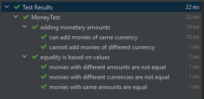
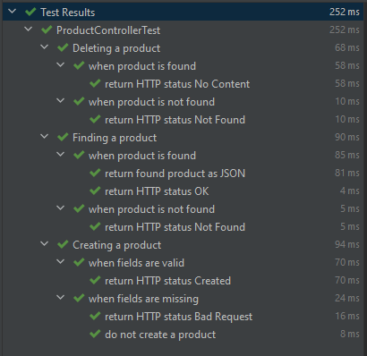

In this tutorial, we will learn how to write JUnit 5 nested tests. We will learn how to provide a hierarchical structure to the tests that describe relationships between the tests.

## Tests Without Nests

To set the stage for the nested tests, let's first look at an example without nesting. The test contents have been left out for brevity, but the complete examples are in GitHub.

```java
public class MoneyTest {
    @Test
    @DisplayName("monies with same amounts and currency are equal")
    void moniesWithSameAmountsAndCurrencyAreEqual() {
        CurrencyUnit eur = CurrencyUnit.of("EUR");
        Money first = Money.of(eur, 3.99);
        Money second = Money.of(eur, 3.99);

        assertEquals(second, first);
    }

    @Test
    @DisplayName("monies with different amounts are not equal")
    void moniesWithDifferentAmountsAreNotEqual() { }

    @Test
    @DisplayName("monies with different currencies are not equal")
    void moniesWithDifferentCurrenciesAreNotEqual() { }

    @Test
    @DisplayName("can add monies of same currency")
    void addMoneyWithSameCurrency() { }

    @Test
    @DisplayName("cannot add monies of different currency")
    void addMoneyWithDifferentCurrency() { }
}
```

So here we have a test that tests some `Money` class. `Money` has some currency and an amount. We can check monies for equality, and we can add them together.

When we run the test from the command line, this is roughly how the output looks like.

```shell
MoneyTest > monies with same amounts and currency are equal PASSED
MoneyTest > can add monies of same currency PASSED
MoneyTest > cannot add monies of different currency PASSED
MoneyTest > monies with different amounts are not equal PASSED
MoneyTest > monies with different currencies are not equal PASSED
```

Here we don't have many tests, so this is still quite readable. However, we can already see that related tests are not necessarily grouped together in the output.

## Adding a Nested Class

JUnit 5 nested tests give us a way to construct a hierarchy in the tests. We can organize the tests in a logical structure. Such nested tests allow us to better express relationships between the tests.

We can add a JUnit 5 nested test by creating an inner class inside the test class and annotating it with the `@Nested` annotation. We can also give the nested class a more readable name with the `@DisplayName` annotation. 

```java
public class MoneyTest {
    @Nested
    @DisplayName("equality is based on values")
    class Equality {
        @Test
        @DisplayName("monies with same amounts are equal")
        void moniesWithSameAmountsAreEqual() { }

        @Test
        @DisplayName("monies with different amounts are not equal")
        void moniesWithDifferentAmountsAreNotEqual() { }

        @Test
        @DisplayName("monies with different currencies are not equal")
        void moniesWithDifferentCurrenciesAreNotEqual() { }
    }

    @Nested
    @DisplayName("adding monetary amounts")
    class Addition {
        @Test
        @DisplayName("can add monies of same currency")
        void addMoneyWithSameCurrency() { }

        @Test
        @DisplayName("cannot add monies of different currency")
        void addMoneyWithDifferentCurrency() { }
    }
}
```

The example is nothing spectacular, but we have separated the concerns of checking for equality and addition. The test has more structure, and related tests are grouped better together.

We can see some differences when we rerun the test from the command line.

```shell
MoneyTest > adding monetary amounts > can add monies of same currency PASSED
MoneyTest > adding monetary amounts > cannot add monies of different currency PASSED
MoneyTest > equality is based on values > monies with different amounts are not equal PASSED
MoneyTest > equality is based on values > monies with different currencies are not equal PASSED
MoneyTest > equality is based on values > monies with same amounts are equal PASSED
```

Compared to the non-nested example, there is a little better organization because related tests are grouped together. The output has a bit more structure, just like the code has.

Running from an IDE is where we start to see some additional benefits of adding a nested structure. Here we have the test results in IntelliJ IDEA.



The report already looks a bit better. Each of the nested classes can be expanded or collapsed, and we can focus on the results we want.

## Adding a Second Layer of Nesting

Let's take a look at a bit more complex example where we are testing a REST controller. We are testing the HTTP POST, GET and DELETE methods for creating, reading, and deleting products. We check for various things like request body field validation and HTTP response status codes.

```java
class ProductControllerTest {
    @Test
    @DisplayName("POST returns HTTP status Bad Request when fields are missing")
    void postReturnsHttpStatusBadRequestWhenFieldsAreMissing() throws Exception {
        Product product = new Product(null, null, null);

        mockMvc.perform(post("/product")
                .contentType(MediaType.APPLICATION_JSON)
                .content(objectMapper.writeValueAsString(product)))
                .andExpect(status().isBadRequest());
    }

    @Test
    @DisplayName("POST does not create a product when fields are missing")
    void postDoesNotCreateProductWhenFieldsAreMissing() throws Exception { }

    @Test
    @DisplayName("POST returns HTTP status Created when fields are valid")
    void postReturnsHttpStatusCreatedWhenFieldsAreValid() throws Exception { }

    @Test
    @DisplayName("GET returns HTTP status Not Found when product is not found")
    void getReturnsHttpStatusNotFoundWhenProductIsNotFound() throws Exception { }

    @Test
    @DisplayName("GET returns HTTP status OK when product is found")
    void getReturnsHttpStatusOkWhenProductIsFound() throws Exception { }

    @Test
    @DisplayName("GET returns found product as JSON when product is found")
    void getReturnsFoundProductAsJsonWhenProductIsFound() throws Exception { }

    @Test
    @DisplayName("DELETE returns HTTP status Not Found when product is not found")
    void deleteReturnsHttpStatusNotFoundWhenProductIsNotFound() throws Exception { }

    @Test
    @DisplayName("DELETE returns HTTP status No Content when product is found")
    void deleteReturnsHttpStatusNoContentWhenProductIsFound() throws Exception { }
}
```

There are some custom display names for the tests, but the descriptions and the method names are getting quite long. We could say that it's getting quite verbose.

Running the tests from the command line demonstrates the same issue.

```shell
ProductControllerTest > POST returns HTTP status Created when fields are valid PASSED
ProductControllerTest > DELETE returns HTTP status No Content when product is found PASSED
ProductControllerTest > GET returns HTTP status OK when product is found PASSED
ProductControllerTest > POST does not create a product when fields are missing PASSED
ProductControllerTest > GET returns HTTP status Not Found when product is not found PASSED
ProductControllerTest > DELETE returns HTTP status Not Found when product is not found PASSED
ProductControllerTest > GET returns found product as JSON when product is found PASSED
ProductControllerTest > POST returns HTTP status Bad Request when fields are missing PASSED
```

We are starting to see that the output starts to get a little harder to read when the number of tests grows. The language itself is easy to read, but it's becoming verbose, and it's missing some structure.

Now let’s check what happens if we add nesting around the HTTP methods and another layer of nesting for assumptions, like if the product exists or does not exist.

```java
class ProductControllerTest {
    @Nested
    @DisplayName("Creating a product")
    class Post {
        @Nested
        @DisplayName("when fields are missing")
        class WhenFieldsAreMissing {
            @Test
            @DisplayName("return HTTP status Bad Request")
            void returnHttpStatusBadRequest() throws Exception { }

            @Test
            @DisplayName("do not create a product")
            void doNotCreateProduct() throws Exception { }
        }

        @Nested
        @DisplayName("when fields are valid")
        class WhenFieldsAreValid {
            @Test
            @DisplayName("return HTTP status Created")
            void returnHttpStatusCreated() throws Exception { }
        }
    }

    @Nested
    @DisplayName("Finding a product")
    class GetById {
        @Nested
        @DisplayName("when product is not found")
        class WhenProductIsNotFound {
            @Test
            @DisplayName("return HTTP status Not Found")
            void returnHttpStatusNotFound() throws Exception { }
        }

        @Nested
        @DisplayName("when product is found")
        class WhenProductIsFound {
            @Test
            @DisplayName("return HTTP status OK")
            void returnHttpStatusOk() throws Exception { }

            @Test
            @DisplayName("return found product as JSON")
            void returnFoundProductAsJson() throws Exception { }
        }
    }

    @Nested
    @DisplayName("Deleting a product")
    class Delete {
        @Nested
        @DisplayName("when product is not found")
        class WhenProductIsNotFound {
            @Test
            @DisplayName("return HTTP status Not Found")
            void returnHttpStatusNotFound() throws Exception { }
        }

        @Nested
        @DisplayName("when product is found")
        class WhenProductIsFound {
            @Test
            @DisplayName("return HTTP status No Content")
            void returnHttpStatusNoContent() throws Exception { }
        }
    }
}
```

The test itself looks longer, but we can see that the descriptions and methods names get more concise.

Modern IDEs also allow collapsing and expanding of complete blocks in the code, so we could, for example, collapse the `Post` and `Delete` classes and only look at the `GetById` class.

Running the test from an IDE now shows how much more structure the test results have. Here is a test run from IntelliJ IDEA.



When we run the test from the command line, we can see that the output has more structure.

```shell
ProductControllerTest > Deleting a product > when product is found > return HTTP status No Content PASSED
ProductControllerTest > Deleting a product > when product is not found > return HTTP status Not Found PASSED
ProductControllerTest > Finding a product > when product is found > return found product as JSON PASSED
ProductControllerTest > Finding a product > when product is found > return HTTP status OK PASSED
ProductControllerTest > Finding a product > when product is not found > return HTTP status Not Found PASSED
ProductControllerTest > Creating a product > when fields are valid > return HTTP status Created PASSED
ProductControllerTest > Creating a product > when fields are missing > return HTTP status Bad Request PASSED
ProductControllerTest > Creating a product > when fields are missing > do not create a product PASSED
```

Related results are faster to find, and the output benefits from the nesting. If we manage to create a well-thought-out structure, it serves like breadcrumbs for navigating the results.

## Avoiding Pitfalls

JUnit 5 nested tests can be a powerful tool when used correctly. Like using any other tool, using nested tests comes with some pitfalls. 

### Ignoring Code Smells

If we get an urge to write nested tests, we should ask ourselves why we want to do that. If the test class is growing large and requires more organization, it could tell that the tested class is doing too many things.

We should ask ourselves:

- Could any of these nested classes be their own concern that we should extract out of the tested class?
- Could any of the assumptions we make with the nested classes indicate that a method under test is doing more than one thing?

Instead of adding more structure to the test, we should consider if there is a need for refactoring. Adding nested tests also adds a little more complexity to the tests. We should always try to avoid added complexity.

### Trying to Remove Duplication

Many tutorials suggest that we remove duplication by constructing shared objects in a `@BeforeEach` method and defining them as class member variables. This advice has good intent but removing duplication from tests has more subtleties than that.

Let's take a close look at the previous product controller test.

```java
        @Nested
        @DisplayName("when product is found")
        class WhenProductIsFound {
            @Test
            @DisplayName("return HTTP status OK")
            void returnHttpStatusOk() throws Exception {
                Product product = new Product(1L, "Toothbrush", BigDecimal.valueOf(5.0));
                when(productRepository.findById(1L)).thenReturn(product);

                mockMvc.perform(get("/product/{productId}", 1L))
                        .andExpect(status().isOk());
            }

            @Test
            @DisplayName("return found product as JSON")
            void returnFoundProductAsJson() throws Exception {
                Product product = new Product(1L, "Toothbrush", BigDecimal.valueOf(5.0));
                when(productRepository.findById(1L)).thenReturn(product);

                mockMvc.perform(get("/product/{productId}", 1L))
                        .andExpect(jsonPath("$.id", is(1)))
                        .andExpect(jsonPath("$.name", is("Toothbrush")))
                        .andExpect(jsonPath("$.price", is(5.0)));
            }
        }
```

Since there is duplication in the product construction, many tutorials suggest removing that duplication using a `@BeforeEach` method.

```java
        @Nested
        @DisplayName("when product is found")
        class WhenProductIsFound {
            @BeforeEach
            void productFound() {
                Product product = new Product(1L, "Toothbrush", BigDecimal.valueOf(5.0));
                when(productRepository.findById(1L)).thenReturn(product);
            }

            @Test
            @DisplayName("return HTTP status OK")
            void returnHttpStatusOk() throws Exception {
                mockMvc.perform(get("/product/{productId}", 1L))
                        .andExpect(status().isOk());
            }

            @Test
            @DisplayName("return found product as JSON")
            void returnFoundProductAsJson() throws Exception {
                mockMvc.perform(get("/product/{productId}", 1L))
                        .andExpect(jsonPath("$.id", is(1)))
                        .andExpect(jsonPath("$.name", is("Toothbrush")))
                        .andExpect(jsonPath("$.price", is(5.0)));
            }
        }
```

Unfortunately, the test is now not self-contained. We cannot see at one glance all the relevant things to the test. There are better ways to remove duplication, such as helper methods, test data builders, or object mothers.

If we examine the example a little closer, the first test does not care about the field values. However, for the second test, the field values are relevant information.

Let's look at how the test looks if we apply the builder pattern and a helper method. 

```java
        @Nested
        @DisplayName("when product is found")
        class WhenProductIsFound {
            @Test
            @DisplayName("return HTTP status OK")
            void returnHttpStatusOk() throws Exception {
                havingPersisted(aProduct().withId(1L));
                
                mockMvc.perform(get("/product/{productId}", 1L))
                        .andExpect(status().isOk());
            }

            @Test
            @DisplayName("return found product as JSON")
            void returnFoundProductAsJson() throws Exception {
                havingPersisted(aProduct().withId(1L).withName("Toothbrush").withPrice(5.0));
                
                mockMvc.perform(get("/product/{productId}", 1L))
                        .andExpect(jsonPath("$.id", is(1)))
                        .andExpect(jsonPath("$.name", is("Toothbrush")))
                        .andExpect(jsonPath("$.price", is(5.0)));
            }
        }
```

We can immediately see that each test only has relevant information. We can also tell what the test does at one glance.

Readability and removing duplication is a broad subject, and we are not going to cover everything here. We will leave the in-depth analysis of readability and maintainability to other articles.

> [!note] Additional reading:
>
> ✏️ [DRY and DAMP in Tests](/dry-damp-tests)
> 
> ✏️ [How to Create a Test Data Builder](/test-data-builders)
> 
> ✏️ [How to Make Your Tests Readable](/test-readability)

## Summary

We can add a hierarchical structure to tests by using nested tests. We can add a nested test by creating an inner class and annotating it with the `@Nested` annotation.

Nested tests allow us to describe the relationships of tests better. Nested tests also help with the readability and navigation of test code and test results. 

You can find the example code for this tutorial on [GitHub](https://github.com/arhohuttunen/junit5-examples/tree/main/junit5-nested-tests).
