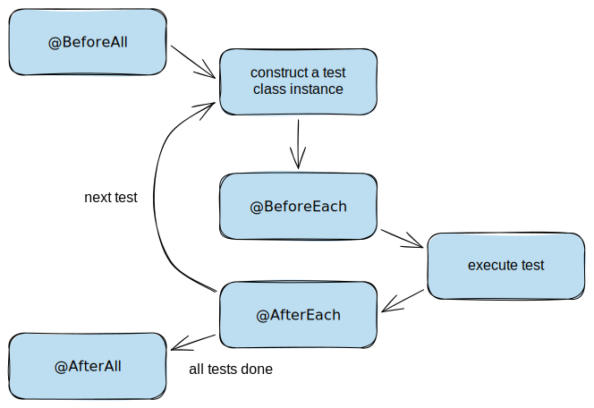
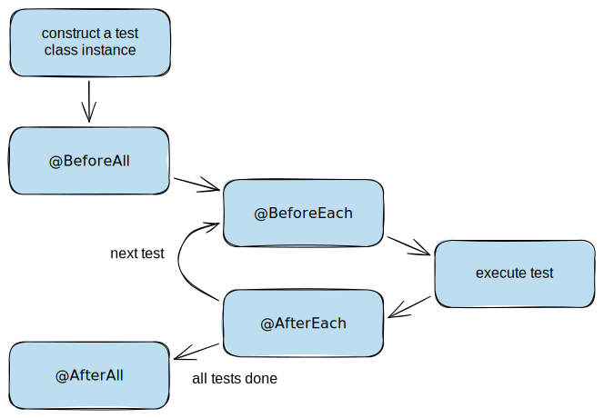

In this tutorial, we will learn how to run code before and after each test or all tests in the test class. We will also see what is the execution order when using nested tests or extensions.

## Lifecycle Methods

A lifecycle method is any method that is annotated with `@BeforeAll`, `@AfterAll`, `@BeforeEach` or `@AfterEach` annotation. The lifecycle methods execute before or after executing the actual test methods.

The `@BeforeAll` and `@AfterAll` annotations denote that the annotated method should be executed before or after all test methods in the test class.

Respectively, `@BeforeEach` and `@AfterEach` mean the annotated method should be executed before or after each test method in the test class.

If you have ten test methods in the test class, `@BeforeEach` and `@AfterEach` will be executed ten times, but `@BeforeAll` and `@AfterAll` only once.

## Test Instance Lifecycle

By default, JUnit creates a new instance of the test class before executing each test method. This helps us to run individual test methods in isolation and avoids unexpected side effects.

To see how this works, let's take a look at the following example:

```java
class PerMethodLifecycleTest {
    public PerMethodLifecycleTest() {
        System.out.println("Constructor");
    }

    @BeforeAll
    static void beforeTheEntireTestFixture() {
        System.out.println("Before the entire test fixture");
    }

    @AfterAll
    static void afterTheEntireTestFixture() {
        System.out.println("After the entire test fixture");
    }

    @BeforeEach
    void beforeEachTest() {
        System.out.println("Before each test");
    }

    @AfterEach
    void afterEachTest() {
        System.out.println("After each test");
    }

    @Test
    void firstTest() {
        System.out.println("First test");
    }

    @Test
    void secondTest() {
        System.out.println("Second test");
    }
}
```

Notice how the methods annotated with `@BeforeAll` and `@AfterAll` are static methods. This is because when creating a new test instance per test method, there is no shared state otherwise. 

The following illustration makes it easier to understand.



Executing the tests in the test class gives us the following output (actually, the output has been formatted to make it more obvious):

```text
Before the entire test fixture
  Constructor
    Before each test
      First test
    After each test
  Constructor
    Before each test
      Second test
    After each test
After the entire test fixture
```

Looking at the output, we can see that JUnit constructs the test class once per each test method. The lifecycle methods for the entire fixture have been executed once, and the lifecycle methods for tests have been executed multiple times.

### Test Instance Per Class

It is also possible to make JUnit execute all test methods on the same test instance. If we annotate the test class with `@TestInstance(Lifecycle.PER_CLASS)`, JUnit will create a new test instance once per test class.

Because of the shared instance, there is now no need for the methods to be static:

```java
@TestInstance(TestInstance.Lifecycle.PER_CLASS)
public class PerClassLifecycleTest {
    @BeforeAll
    void beforeTheEntireTestFixture() {
        System.out.println("Before the entire test fixture");
    }

    @AfterAll
    void afterTheEntireTestFixture() {
        System.out.println("After the entire test fixture");
    }

    // ...
}
```

Again, the following illustration helps to understand what is happening.



Consequently, the output of the test execution is now a little different:

```text
Constructor
  Before the entire test fixture
    Before each test
      First test
    After each test
    Before each test
      Second test
    After each test
  After the entire test fixture
```

From the results, we can see that the execution order of the lifecycle methods has not changed
However, the difference is that JUnit constructs the test class only once.

The fundamental difference is that in the default lifecycle method constructing a new test class instance resets the state stored in instance variables.
When the per class lifecycle method constructs the instance only once, state stored in instance variables is shared between tests.

> [!warning]
> If your test methods rely on state stored in instance variables, you may need to reset the state in `@BeforeEach` or `@AfterEach` lifecycle methods.
> 
> Try to avoid writing tests that rely on state stored in instance variables.

### More Concrete Example

Now that we know how the lifecycle methods work, it's good to explore how they can be used in practice. Usually, if we have something computationally expensive, we might want to share that with multiple tests.

Examples of this are opening a database connection, retrieving a context from a dependency injection framework, or reading a file.

In the following example, we start up a server only once per test instance:

```java
@TestInstance(TestInstance.Lifecycle.PER_CLASS)
public class ExpensiveResourceTest {
    private JettyServer jettyServer;

    @BeforeAll
    void startServer() throws Exception {
        jettyServer = new JettyServer();
        jettyServer.start();
    }

    @AfterAll
    void stopServer() throws Exception {
        jettyServer.stop();
    }

    @Test
    void checkServerStatus() throws IOException {
        URL url = new URL("http://localhost:8080/status");
        HttpURLConnection connection =
                (HttpURLConnection) url.openConnection();
        int response = connection.getResponseCode();

        assertEquals(200, response);
    }

    @Test
    void checkInvalidEndpoint() throws IOException {
        URL url = new URL("http://localhost:8080/invalid");
        HttpURLConnection connection =
                (HttpURLConnection) url.openConnection();
        int response = connection.getResponseCode();

        assertEquals(404, response);
    }
}
```

## Nested Test Lifecycle

Lifecycle methods can be applied to nested tests as well. However, by default, `@BeforeAll` and `@AfterAll` methods do not work. This is because nested tests need to be inner classes, and Java does not support static methods for inner classes.

The way to make it work is to annotate the nested class with `@TestInstance(Lifecycle.PER_CLASS)`:

```java
public class NestedLifecycleTest {
    @Nested
    class HappyPath {
        @BeforeEach
        void beforeEachHappyPath() {
            System.out.println("Before each happy path");
        }

        @AfterEach
        void afterEachHappyPath() {
            System.out.println("After each happy path");
        }

        @Test
        void happyPathOne() {
            System.out.println("Happy path one");
        }

        @Test
        void happyPathTwo() {
            System.out.println("Happy path two");
        }
    }

    @Nested
    @TestInstance(TestInstance.Lifecycle.PER_CLASS)
    class ExceptionalPath {
        @BeforeAll
        void beforeEntireExceptionalPath() {
            System.out.println("Before entire exceptional path");
        }

        @AfterAll
        void afterEntireExceptionalPath() {
            System.out.println("After entire exceptional path");
        }

        @Test
        void exceptionalPathOne() {
            System.out.println("Exceptional path one");
        }

        @Test
        void exceptionalPathTwo() {
            System.out.println("Exceptional path two");
        }
    }
}
```

As we can see, the lifecycle methods apply to the nested tests individually:

```text
Before entire exceptional path
  Exceptional path one
  Exceptional path two
After entire exceptional path
Before each happy path
  Happy path one
After each happy path
Before each happy path
  Happy path two
After each happy path
```

> [!note] Additional reading:
> 
> :pencil2: [JUnit 5 Nested Tests](/junit-5-nested-tests)

## Extension Lifecycle

When using extensions, JUnit calls extension lifecycle callbacks in addition to the lifecycle methods of the test class.

JUnit guarantees wrapping behavior for multiple registered extensions. Given extensions `ExtensionOne` and `ExtensionTwo`, it's guaranteed the "before" callbacks of `ExtensionOne` execute before `ExtensionTwo`. Similarly, it's guaranteed any "after" callbacks of `ExtensionOne` execute after `ExtensionTwo`.

Again, let's take a look at an example:

```java
public class ExtensionOne implements BeforeEachCallback, AfterEachCallback {
    @Override
    public void beforeEach(ExtensionContext context) {
        System.out.println("Before each from ExtensionOne");
    }

    @Override
    public void afterEach(ExtensionContext context) {
        System.out.println("After each from ExtensionOne");
    }
}

@ExtendWith(ExtensionOne.class)
@ExtendWith(ExtensionTwo.class)
public class ExtensionLifecycleTest {
    @BeforeEach
    void beforeEachTest() {
        System.out.println("Before each test");
    }

    @AfterEach
    void afterEachTest() {
        System.out.println("After each test");
    }

    @Test
    void firstTest() {
        System.out.println("First test");
    }

    @Test
    void secondTest() {
        System.out.println("Second test");
    }
}
```

Executing the example, we can see the wrapping behavior of the extensions:

````text
Before each from ExtensionOne
  Before each from ExtensionTwo
    Before each test
      First test
    After each test
  After each from ExtensionTwo
After each from ExtensionOne
Before each from ExtensionOne
  Before each from ExtensionTwo
    Before each test
      Second test
    After each test
  After each from ExtensionTwo
After each from ExtensionOne
````

> [!note] Additional reading:
> JUnit 5 documentation has more in-depth details about the relative execution order of user code and extensions.
> 
> :bookmark: [JUnit 5 User Guide](https://junit.org/junit5/docs/current/user-guide/#extensions-execution-order)

## Summary

To execute a piece of code before and after each test, we can use the JUnit 5 `@BeforeEach` and `@AfterEach` annotations. In addition, to execute code once for all tests in the test instance, we can use the `@BeforeAll` and `@AfterAll` annotations.

Furthermore, we can change test instances to be created once per test class by annotating the test class with `@TestInstance(Lifecycle.PER_CLASS)`. This also enables the "before all" and "after all" lifecycle methods for nested tests.

Finally, when registering multiple extensions, JUnit 5 guarantees wrapping behavior for their lifecycle callbacks.

The example code for this guide can be found on [GitHub](https://github.com/arhohuttunen/junit5-examples/tree/main/junit5-lifecyle).
