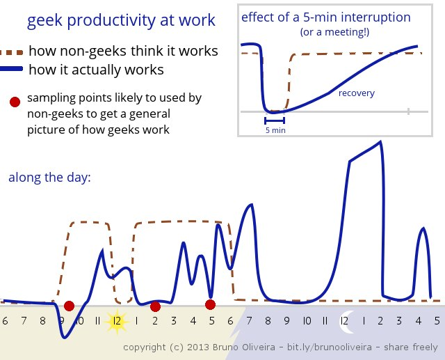
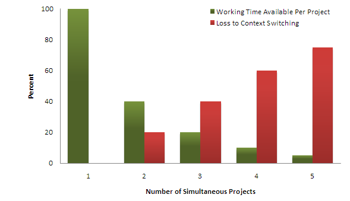

Developers hate interruptions. They hate them so much that they write blog posts about it. This hate builds on the premise that we need uninterrupted periods of individual focused time. However, the way we build software is becoming more and more collaborative. This creates a tension between the need for individual focus and team contributions.

In this article, we'll look at some approaches for making developer interruptions less disruptive. What I am about to say is going to sound very controversial to many people.

## Flow State In Knowledge Work

In positive psychology, a flow state is a mental state in which a person is fully immersed in a task.[^1] When a person is in a flow state, they remain completely focused and may not notice the time passing. It is this kind of deep focus that we see ideal for solving hard problems.

It's very easy to relate to this because we have experienced it. We focus hard on a problem. Someone walks in and asks a completely unrelated question. Poof, we're completely thrown off track, and it takes time to regain focus.

This is how we approach knowledge work by default. Developer time is sacred and must be protected.

We blame open floor plans, wear noise-canceling headphones, avoid disturbing our colleagues, skip unnecessary meetings, and try to explain the cost of interruption to managers.

Yet, none of those approaches are particularly effective. We still need to attend to some meetings. We still need to review the code. We still need to ask for help. And most definitely someone is going to come and ask about the status of that feature scheduled for this sprint.

In fact, a lot of these attempts have adversary effects.

## The Productivity Paradox

The fear of interrupting someone can increase the threshold of asking for help. By delaying questions work piles up. Pull requests get bigger. When pull requests get bigger, feedback is further delayed.

And while we are waiting, what happens next? We take up on additional work. Now instead of putting all our efforts on getting one thing done, we are dividing our attention.

According to psychologist Gerald Weinberg, each extra task or context switch eats up 20% of your productivity.[^2] That means that by the time we add a third task on our table, we waste nearly half of our time in context switching.

We loathe the idea of being interrupted, but willingly give up our right to concentrate by working the way we do. It's much easier to blame someone else than ourselves.

> WIP is a leading indicator of cycle time. The more items that are worked on at the same time, the more doors open up that allow dependencies and interruptions to creep in.[^3]

Whenever we batch work and delay feedback, we increase the risk of rework. Problems that could be solved right away become bigger issues. Bigger reviews mean sloppier reviews. As we delay merging the code, the chance of merge conflicts increases. Since the effects compound, we start avoiding refactoring.

And so, by wanting to protect our time, and not wanting to disturb each other, we have opened a door for the quality to degrade.

For many people, this is the accepted reality. This is how things are.

## Collaboration and Interruptions

Let's turn around the premise that interruptions are bad. Instead of avoiding interruptions, how can we make them less distracting?

When we work alone, interruptions are a catastrophe. It takes a small eternity to get back on track. When we focus our efforts on team performance, we sacrifice individual performance for the overall performance. This means that answering questions becomes a priority.

> The best way to prevent questions from being disruptive is to use pair programming or mob programming.[^4]

In the practice of **pair programming**, two programmers sit in front of a single computer working together to solve a problem. While one other person is typing, the other is thinking ahead and reviewing the code. This ends up being a great way to share information and ensure better quality.

When a pair is interrupted, one person can answer the question while the other keeps thinking about the problem. Getting back on track is as easy as asking where we were.

> When working solo, you can get distracted a lot easier, e.g. by "just quickly" trying a different approach without thinking it through, and then coming back out of the rabbit hole hours later. Your pairing partner can prevent you from going down those rabbit holes and focus on what is important to finish your task or story.[^5]

**Mob programming**, or **ensemble programming**, is a group technique where you put the entire team in front of one computer and focus on one task at a time. It is an approach that allows people to come and go as needed without a negative impact on the work that happens.

A group can absorb interruptions much better than an individual. When mobbing, there are much fewer interruptions. When they happen, one can just step away while the rest of the group keeps working.

> After doing Mob Programming for a while we noticed that many of the problems we had previously faced were no longer affecting us. While we hadn’t directly attempted to solve these problems we noticed they were simply fading away.[^6]

Many of the issues that teams have to deal with when working individually are irrelevant when mobbing. You don't need daily stand-ups. There are no pull requests to review. On-boarding new members and learning new things is easy. There is no context switching. Since the team works on one thing at a time, there is no need for status updates.

This may feel like two or more people doing the work of one. There's more to programming than just typing. The part where we type the code is only part of the solution. We have to account for reviews, testing, rework, fixing issues, and so on. When working as individuals, we spend most of the time waiting for someone else.

When we use one of these co-creational patterns, review delays and wait times are non-existent. The size of a pull request effectively approaches zero, as every line of code is reviewed as it's typed. There are no availability issues since we make everyone available.

Development practices like branch-based workflows and pull requests increase the number of tasks in progress. In contrast, pair or mob programming attempt to minimize them. There are fewer tasks in progress, which reduces the amount of context switching.

## Conclusion

I used to think that one must avoid developer interruptions at all costs. That's not the reality I accept anymore.

Uninterrupted periods of individual focused time are not the only way to solve hard problems. If we work collaboratively and have appropriate engineering practices in place, it's possible to deal with interruptions and come back to work without great impact. 

[^1]: Csikszentmihalyi, Mihaly. Flow: The Psychology of Optimal Experience. Harpercollins, 1990.
[^2]: Weinberg, Gerald. Quality Software Management: Systems Thinking. Dorset House, 1991.
[^3]: DeGrandis, Dominica. Making Work Visible: Exposing Time Theft to Optimize Work & Flow. IT Revolution Press, 2017.
[^4]: Shore, James, and Shane Warden. The Art of Agile Development. O’Reilly Media, 2022.
[^5]: Böckeler, Birgitta, and Siessegger, Nina. “On Pair Programming.” (2020): https://martinfowler.com/articles/on-pair-programming.html.
[^6]: Zuill, Woody. “Mob Programming – a Whole Team Approach.” (2014): https://www.agilealliance.org/resources/experience-reports/mob-programming-agile2014.
