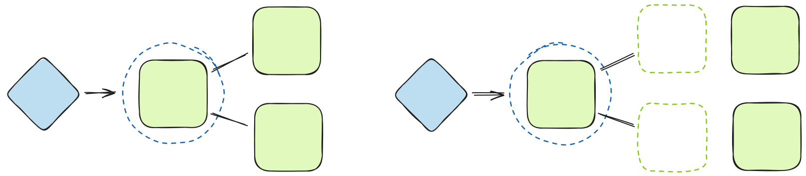
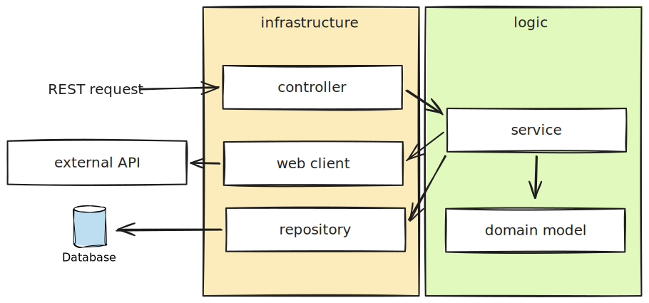

In this article, we look at an overall Spring Boot testing strategy and how to organize the application for testability.

First, we discuss ambiguous testing terminology and why to avoid debating what types of tests to write. Then we look at desirable characteristics of tests and examine a testing strategy that achieves those goals.

## The Practical Test Pyramid

Before we begin, it is worth mentioning that there is a lack of clarity about unit and integration testing. In the recent years, the [Test Pyramid](https://martinfowler.com/bliki/TestPyramid.html) has received some critique stating that it has fallen out of style.

Some people call tests that are allowed to talk to real collaborators integration tests. Some call them **sociable unit tests**. Usually, the first group of people think unit tests are **solitary unit tests** that are not allowed to talk to collaborators. Essentially, these groups are talking about the same thing.

The definition of integration test is ambiguous as well. There are both **narrow integration tests** and **broad integration tests** that either test part of the system or the system as a whole.



Debating whether you should write unit tests or integration tests distracts us from what is really important. We should focus on **writing expressive tests**, **establishing clear architectural boundaries** and making sure they **run fast**, **are reliable** and **only fail for useful reasons**.

These attributes complement each other very well. If we leverage some patterns that improve one of these attributes, we end up improving other areas as well. Let's look at some ways to achieve these goals.

> [!note] Additional reading:
> 
> :bookmark: [On the Diverse And Fantastical Shapes of Testing](https://martinfowler.com/articles/2021-test-shapes.html) by Martin Fowler

## Only Mock Across Architectural Boundaries

If we interpret unit testing as something where we only test classes in isolation, we can end up with **too many mocks**. When we  mock all the interactions between classes, the test **setup becomes complex**. Tests become **tightly coupled** to the implementation details, meaning that tests **easily break** when refactoring.

If we try to avoid the problems of too much mocking by only focusing on broader tests, we will face other problems. Broader tests are **much slower** than narrower tests and they are **more sensitive to faults in other parts of the system**.

> [!warning]
> Too many mocks can be an actual issue. However, making a conclusion that we should focus most of our efforts on broader tests is incorrect. We should treat this input as an opportunity to improve the design. Some design improvements have the side-effect of reducing mocks.

Between these two extremes, there is a sweet spot. We **mock across architectural boundaries** but **don't mock inside those boundaries**. These boundaries include things like the database or external services.

```java
@ExtendWith(MockitoExtension.class)
class OrderServiceTests {
    @Mock
    private OrderRepository orderRepository;
    @InjectMocks
    private OrderService orderService;

    @Test
    void payOrder() {
        Order order = new Order(1L, false);
        when(orderRepository.findById(1L)).thenReturn(Optional.of(order));

        Payment payment = orderService.pay(1L, "4532756279624064");

        assertThat(payment.getOrder().isPaid()).isTrue();
    }
}
```

Such tests are simpler to set up, run faster, and more reliably. Also, failure scenarios are easier to simulate through mocks.



The conclusion here is that we should write both solitary and sociable tests. However, to avoid coupling within the architectural boundaries, we should prefer **sociable tests that are allowed to talk to collaborators**. If we extract some code inside our service code into another service, it doesn't mean that we then have to mock that other service.

> [!note] Additional reading:
> 
> :bookmark: [When to Mock](https://blog.cleancoder.com/uncle-bob/2014/05/10/WhenToMock.html) by Uncle Bob

## Write Narrow Integration Tests For Outside Interactions

Unit tests test code that resides in memory. However, our software doesn't run entirely in memory and has to talk to the outside world. To test these interactions, we can write **narrow integration tests**, also known as **focused integration tests**.

We can minimise the number of narrow integration tests with a careful design. For example, if we depend on a third-party service, we shouldn't call the service directly from the code that needs it.

Instead, we can create a wrapper that encapsulates the code that makes the network calls. We can now test this wrapper with narrow integration tests and use unit tests to test the code that uses it.

```java
public class ExchangeRateClient {
    private final WebClient webClient;

    public BigDecimal getExchangeRate(CurrencyUnit from, CurrencyUnit to) {
        // ...
        return webClient.get()
                .uri(baseUrl + "/v6/{apiKey}/pair/{from}/{to}", apiKey, from, to)
                .retrieve()
                .bodyToMono(ExchangeResponse.class)
                .blockOptional()
                .map(ExchangeResponse::getConversionRate)
                .orElseThrow(ExchangeFailure::new);
    }
}
```

The Spring Boot test slices like `@WebMvcTest` and `@DataJpaTest` allow us to write focused tests for only a part of the application. These slices only load part of the application context, making the tests run faster.

## Simulate External Dependencies

When we write narrow integration tests, we should attempt to run any external dependencies locally. This makes our tests both faster and more reliable.

For example, there is no need to use an external database when we can run one locally. We can do this using Testcontainers, which will spin up the database inside a Docker container. The added benefit is that our database is always in a known state.

```java
@DataJpaTest
@AutoConfigureTestDatabase(replace = AutoConfigureTestDatabase.Replace.NONE)
@TestPropertySource(properties = {
        "spring.datasource.url=jdbc:tc:postgresql:13.6-alpine://payment"
})
class PaymentRepositoryIntegrationTests {
    // ...
}
```

Similarly, if we integrate with an external service, we can run a fake instance of such service locally using e.g. `MockWebServer`. When we create a wrapper for the client that is independent from the framework, we don't need Spring application context in our test.

```java
public class ExchangeRateClientIntegrationTests {
    private MockWebServer mockWebServer;
    private ExchangeRateClient exchangeRateClient;

    @BeforeEach
    void setupMockWebServer() {
        mockWebServer = new MockWebServer();
        // ...
        exchangeRateClient = new ExchangeRateClient(WebClient.create(), properties);
    }
}
```

## Establish Clear Boundaries

The easiest code to test is code that has no dependencies on the outside world. If we want to make our tests faster and more reliable, we have to establish clear boundaries. We can do this by **separating logic from the infrastructure**.

We want to keep our logic layer pure in such a way that it doesn't depend on any infrastructure code. There are a lot of ways to achieve this.

One way is to use a **layered architecture**. In a traditional Spring Boot application that would look like arranging the code into controllers, services, domain model and repositories. Unfortunately sometimes people end up capturing all the logic within service classes. The domain model becomes **anaemic** meaning that it contains only data and not behavior.

Another popular way is to use [Hexagonal Architecture](/hexagonal-architecture), which makes the external and internal concerns more explicit.

Examples of separating logic from infrastructure in a Spring Boot application:

- The controllers should not involve business logic, such as how to calculate an amount after currency exchange.
- A controller endpoint should not call several services but a single use case instead.
- The services should not know how to deserialize or serialize JSON.
- The services should not know how to make an HTTP request.

Remember the previous `ExchangeRateClient` example? That is separating logic from infrastructure in action. We establish a boundary between the service and the code that needs to call `WebClient`.



The service does not need to know how to make an HTTP request. If it does, we have to fall back to broader tests for the service.

Incidentally, following this separation keeps the design clean. As soon as one of the details leak into either direction, testing becomes more difficult.

## Broad Integration Tests

If we use all the different level tests correctly, we should have covered our code throughly. High coverage doesn't mean high confidence. We should use broader tests as a safety net to make sure our application works correctly.

Broader tests **don't need to be comprehensive** and should **only test the most common scenarios**. We should test conditional logic or edge cases in the lower-level tests.

In the following example, we only care if a payment succeeds. We don't care about the details that can be tested in the controller integration tests and the service unit tests.

```java
@SpringBootTest(webEnvironment = SpringBootTest.WebEnvironment.RANDOM_PORT)
class PaymentEndToEndTests {
    // ...

    @Test
    void payOrder() {
        Order order = new Order(LocalDateTime.now(), BigDecimal.valueOf(100.0), false);
        Long orderId = orderRepository.save(order).getId();

        webClient.post().uri("/order/{id}/payment", orderId)
                .contentType(MediaType.APPLICATION_JSON)
                .bodyValue("{\"creditCardNumber\": \"4532756279624064\"}")
                .exchange()
                .expectStatus().isCreated();
    }
}
```

If a higher-level test catches an error and there is no lower-level test failing, we should write a lower level test for it if possible. We should try to push the tests as far down the test pyramid as possible.

## Make the Tests Expressive

So far, we have been talking about different levels of tests and how architectural boundaries also help with testing. Making the tests run fast and reliably is important, but one area that is often neglected is making the tests more expressive.

Before, I've written extensively about making your tests more readable, so we are not going too deep into that here. Some patterns that help in this aspect are **custom assertions**, **test data builders** and **helper methods**.

> [!note] Additional reading:
> 
> :pencil2: [DRY and DAMP in Tests](/dry-damp-tests)
> 
> :pencil2: [How to Make Your Tests Readable](/test-readability)

Let's take a quick look at an example.

```java
@WebMvcTest(OrderController.class)
class OrderControllerIntegrationTests {
    @MockBean
    private OrderService orderService;
    @Autowired
    private MockMvc mockMvc;

    @Test
    void payOrder() throws Exception {
        Order order = new Order(1L, LocalDateTime.now(), BigDecimal.valueOf(100.0), false);
        Payment payment = new Payment(1000L, order, "4532756279624064");
        when(orderService.pay(1L, "4532756279624064")).thenReturn(payment);

        mockMvc.perform(post("/order/{id}/payment", 1L)
                .contentType(MediaType.APPLICATION_JSON)
                .content("{\"creditCardNumber\": \"4532756279624064\"}"))
                .andExpect(status().isCreated())
                .andExpect(header().string(HttpHeaders.LOCATION, "http://localhost/order/1/receipt"));
    }

    @Test
    void paymentFailsWhenOrderIsNotFound() throws Exception {
        when(orderService.pay(eq(1L), any())).thenThrow(EntityNotFoundException.class);

        mockMvc.perform(post("/order/{id}/payment", 1L)
                .contentType(MediaType.APPLICATION_JSON)
                .content("{\"creditCardNumber\": \"4532756279624064\"}"))
                .andExpect(status().isNotFound());
    }
}
```

One thing that is easy to spot is that there is some duplication. Another thing is that it's not super readable.

Now, what would we do if we saw duplication in our code? Yes, we would probably extract the code into its own method.

First, we can extract the mocking parts into its own descriptive methods.

```java
    private void givenPaymentWillSucceed(Long orderId) {
        Order order = new Order(orderId, LocalDateTime.now(), BigDecimal.valueOf(100.0), false);
        Payment payment = new Payment(1000L, order, "4532756279624064");
        given(orderService.pay(orderId, "4532756279624064")).willReturn(payment);
    }

    private void givenOrderIsNotFound(Long orderId) {
        given(orderService.pay(eq(orderId), any())).willThrow(EntityNotFoundException.class);
    }
```

We can also wrap the REST request building into a separate class.

```java
public class PaymentRequestBuilder {
    private final MockMvc mockMvc;

    PaymentRequestBuilder(MockMvc mockMvc) {
        this.mockMvc = mockMvc;
    }

    public ResultActions pay(Long orderId) throws Exception {
        return mockMvc.perform(post("/order/{id}/payment", orderId)
                .contentType(MediaType.APPLICATION_JSON)
                .content("{\"creditCardNumber\": \"4532756279624064\"}"));
    }
}
```

After a couple of minor changes, our tests become much more compact and expressive.

```java
@WebMvcTest(OrderController.class)
class OrderControllerIntegrationTests {
    @MockBean
    private OrderService orderService;
    @Autowired
    private MockMvc mockMvc;

    private PaymentRequestBuilder paymentEndpoint;

    @BeforeEach
    void before() {
        paymentEndpoint = new PaymentRequestBuilder(mockMvc);
    }

    @Test
    void payOrder() throws Exception {
        givenPaymentWillSucceed(1L);

        paymentEndpoint.pay(1L)
                .andExpect(status().isCreated())
                .andExpect(header().string(HttpHeaders.LOCATION, "http://localhost/order/1/receipt"));
    }

    @Test
    void paymentFailsWhenOrderIsNotFound() throws Exception {
        givenOrderIsNotFound(1L);

        paymentEndpoint.pay(1L)
                .andExpect(status().isNotFound());
    }
}
```

Incidentally, while we are making the test code more readable, we also make it more maintainable at the same time. Extracting pieces of test functionality into their own methods increases reuse and **isolates the risk of change**.

## Summary

It is worth understanding that testing terminology is ambiguous.  Whatever terminology used, we should focus on writing expressive tests, establishing clear architectural boundaries and making sure the tests run fast, are reliable and only fail for useful reasons.

We should use mocks sparingly only on the architectural boundaries. We should take too many mocks as an input to improve the design and establish such boundaries.

To verify outside interactions, we can also write narrow integration tests and try to simulate external dependencies locally. We should use only a few broad integration tests to verify that the system works as a whole.

Finally, we often neglect making the tests expressive. We should use test data builders, custom assertions, helper methods, and descriptive naming to make the tests readable. This also makes the test code more maintainable by isolating the risk of change.

You can find the example code for this article on [GitHub](https://github.com/arhohuttunen/spring-boot-test-examples/tree/main/spring-boot-testing-strategy).
