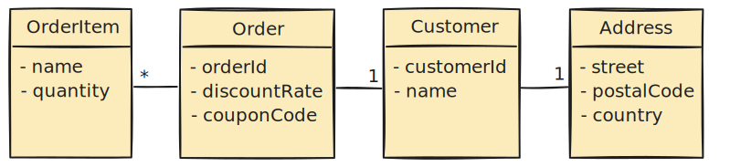

In this article, we will learn how to write test data builders that remove duplication in constructing objects and increase the expressiveness of the test code. We will also learn how to use Lombok to reduce boilerplate code around the builders.

In a [previous article](/dry-damp-tests), we talked about how to remove duplication while at the same time making the code more descriptive. This article is a more practical guide concentrating on the test data builder pattern.

## 🧰 Constructing Complex Test Data

Let's imagine we have an `Order` class with a `Customer` and a customer has an `Address`. Also, an `Order` has one or more `OrderItem`s. Furthermore, the `Order` might involve a `discountRate` or some `couponCode`.



We might want to test a lot of business logic around these objects:

1. Check that we cannot apply a discount rate and coupon code at the same time
2. Check that the quantity of items does not exceed the inventory balance
3. Check that we apply different shipping rate on a foreign address

For different use cases, we have to create objects in different state. In our production code, we create things in relatively few places. However, in tests, we have to provide all the constructor arguments every time creating an object.

Let's take a look at a code example.

```java
public class Order {
    private final Long orderId;
    private final Customer customer;
    private final List<OrderItem> orderItems = new ArrayList<>();
    private final Double discountRate;
    private final String couponCode;
    
    public Order(Long orderId, Customer customer, Double discountRate, String couponCode) {
        // ...
    }
    
    public void addOrderItem(OrderItem orderItem) {
        orderItems.add(orderItem);
    }

    // ...
}

public class Customer {
    private final Long customerId;
    private final String name;
    private final Address address;
    
    // ...
}
```

In this example, we use constructors and immutable objects, so they do not have setter methods. The test code becomes quite hard to read.

```java
    @Test
    void constructOrderWithForeignAddress() {
        Address address = new Address("1216  Clinton Street", "Philadelphia", "19108", "United States");
        Customer customer = new Customer(1L, "Terry Tew", address);
        Order order = new Order(1L, customer, 0.0, null);
        order.addOrderItem(new OrderItem("Coffee mug", 1));
        
        // ...
    }
```

The code is full of **details that are irrelevant to the behavior** that we test. The result is very noisy. Also, **tests become brittle** because adding any new parameters will break a lot of tests.

## 👵 Reduce Duplication With the Object Mother Pattern

The object mother pattern is an attempt to avoid the before-mentioned problems. An object mother is **a class with factory methods for different use cases** in tests.

Let's take a look at a couple of object mothers.

```java
public class Orders {
    public static Order createOrderWithCustomer(Customer customer) {
        return new Order(1L, customer, 0.0, null);
    }
}

public class Customers {
    public static Customer createCustomerWithAddress(Address address) {
        return new Customer(1L, "Unimportant", address);
    }
}

public class Addresses {
    public static Address createAddressWithCountry(String country) {
        return new Address("Some street", "Some city", "Some postal code", country);
    }
}

// ...
```

Now we call our factory methods from the test code.

```java
    @Test
    void constructOrderWithForeignAddress() {
        Address address = Addresses.createAddressWithCountry("United States");
        Customer customer = Customers.createCustomerWithAddress(address);
        Order order = Orders.createOrderWithCustomer(customer);
        order.addOrderItem(OrderItems.createOrderItem("Coffee mug"));
        
        // ...
    }
```

The object mother pattern **makes tests more readable** and **hides code that creates new objects**. We can provide safe values for fields without having to pollute the test code with those values. It also helps with maintenance because we can **reuse the code between tests**.

However, the object mother pattern is not flexible when test data varies. Every small change in test data requires a new factory method. Having to change the object mother for a lot of different reasons violates the [Single Responsibility Principle](https://en.wikipedia.org/wiki/Single-responsibility_principle).

## 🏗️ Make Construction Easier With the Builder Pattern

The [Builder pattern](https://en.wikipedia.org/wiki/Builder_pattern) is a design pattern designed to provide a flexible solution to various object creation problems in object-oriented programming. The Builder design pattern intends to **separate the construction of a complex object from its representation**.

For classes that require complex setup we can create a test data builder. The builder has a field for each constructor parameter.

```java
public class OrderBuilder {
    private Long orderId;
    private Customer customer;
    private List<OrderItem> orderItems = new ArrayList<>();
    private Double discountRate;
    private String couponCode;

    public OrderBuilder withId(Long orderId) {
        this.orderId = orderId;
        return this;
    }

    public OrderBuilder withCustomer(Customer customer) {
        this.customer = customer;
        return this;
    }

    public OrderBuilder withOrderItem(OrderItem orderItem) {
        this.orderItems.add(orderItem);
        return this;
    }

    public OrderBuilder withDiscountRate(Double discountRate) {
        this.discountRate = discountRate;
        return this;
    }

    public OrderBuilder withCouponCode(String couponCode) {
        this.couponCode = couponCode;
        return this;
    }

    public Order build() {
        Order order = new Order(orderId, customer, discountRate, couponCode);
        orderItems.forEach(order::addOrderItem);
        return order;
    }
}
```

We provide the actual values using public "with" methods which can be chained.

```java
    @Test
    void constructOrderWithForeignAddress() {
        Order order = new OrderBuilder()
                .withId(1L)
                .withCustomer(new CustomerBuilder()
                        .withCustomerId(1L)
                        .withName("Terry Tew")
                        .withAddress(new AddressBuilder()
                                .withStreet("1216  Clinton Street")
                                .withCity("Philadelphia")
                                .withPostalCode("19108")
                                .withCountry("United States")
                                .build()
                        )
                        .build()
                )
                .withOrderItem(new OrderItemBuilder()
                        .withName("Coffee mug")
                        .withQuantity(1)
                        .build()
                )
                .build();
    }
```

The example doesn't provide any advantage over the object mother yet. Next, let's look at how we can improve the situation.

### 🙈 Set Safe Default Values to Hide Details

If our classes expect some values to exist, our test code has to provide these values. However, a lot of times, these values might not be relevant to the test case. We want to **hide the details that are irrelevant to the test**.

Let's change the way we build the dependent objects.

```java
public class OrderBuilder {

    private Long orderId = 1L;
    private Customer customer = new CustomerBuilder().build();
    private List<OrderItem> orderItems = new ArrayList<>();
    private Double discountRate = 0.0;
    private String couponCode;
  
    // ...
}

public class AddressBuilder {
    private String street = "Some street";
    private String city = "Some city";
    private String postalCode = "Some postal code";
    private String country = "Some country";

    // ...
}
```

By setting a default value to the `customerBuilder` field and any other fields, we provide safe values for these fields. This way, we can **omit any fields that are not relevant** to our test but require a value.

```java
    @Test
    void constructOrderWithForeignAddress() {
        Order order = new OrderBuilder()
                .withCustomer(new CustomerBuilder()
                        .withAddress(new AddressBuilder().withCountry("United States").build())
                        .build()
                )
                .withOrderItem(new OrderItemBuilder()
                        .withName("Coffee mug")
                        .withQuantity(1)
                        .build()
                )
                .build();
    }
```

Now the test data builder can hide details like the object mother pattern does. However, the builder is more flexible than the object mother. 

### ➡️ Simplify Code by Passing Builders as Arguments

In our builder example, the builder consumes some arguments that are objects built by other builders. If we pass those builders as arguments instead of the constructed objects, we can simplify the code by removing the calls to `build()` methods.

```java
public class OrderBuilder {
    // ...

    public OrderBuilder withCustomer(CustomerBuilder customerBuilder) {
        this.customer = customerBuilder.build();
        return this;
    }
    
    // ...
}
```

Now using the builder becomes less verbose. 

```java
    @Test
    void constructOrderWithForeignAddress() {
        Order order = new OrderBuilder()
            .witCustomer(new CustomerBuilder()
                    .withAddress(new AddressBuilder().withCountry("United States"))
            )
            .withOrderItem(new OrderItemBuilder().withName("Coffee mug").withQuantity(1))
            .build();
```

We were able to get rid of some syntax noise. 

### 🏭 Emphasize Domain With Factory Methods

There is still some noise in the tests because we have to construct various builders. We can reduce this noise by adding factory methods for the builders.

```java
public class OrderBuilder {
    // ...

    private OrderBuilder() {}

    public static OrderBuilder anOrder() {
        return new OrderBuilder();
    }

    // ...
}
```

We are still duplicating the name of the constructed type in both the "with" methods and the builder names. We can take advantage of the type system and shorten the names of the "with" methods.

```java
public class OrderBuilder {
    // ...

    public OrderBuilder with(CustomerBuilder customerBuilder) {
        this.customer = customerBuilder.build();
        return this;
    }

    // ...
}
```

By using static imports we can avoid mentioning the word "builder" in the tests.

```java
    @Test
    void buildOrderWithForeignAddress() {
        Order order = anOrder()
                .with(aCustomer().with(anAddress().withCountry("United States")))
                .with(anOrderItem().withName("Coffee mug").withQuantity(1))
                .build();
    }
```

The factory methods hide a lot of details about the builders. The code is now more descriptive as it speaks in domain terms.

### ♊ Reduce Code When Creating Similar Objects

If we need to create similar objects, we could use different builders for them. However, different builders lead to duplication and make it harder to spot differences.

Let's take a look at the following example.

```java
    Order orderWithSmallDiscount = anOrder()
            .with(anOrderItem().withName("Coffee mug").withQuantity(1))
            .with(anOrderItem().withName("Tea cup").withQuantity(1))
            .withDiscountRate(0.1)
            .build();
    Order orderWithBigDiscount = anOrder()
            .with(anOrderItem().withName("Coffee mug").withQuantity(1))
            .with(anOrderItem().withName("Tea cup").withQuantity(1))
            .withDiscountRate(0.5)
            .build();
```

Because of the repetition in the construction, the difference with the discount rate gets hidden in the noise. We can **extract a builder with a joint state** and then provide the differing values for each object separately. 

```java
    OrderBuilder coffeeMugAndTeaCup = anOrder()
            .with(anOrderItem().withName("Coffee mug").withQuantity(1))
            .with(anOrderItem().withName("Tea cup").withQuantity(1));

    Order orderWithSmallDiscount = coffeeMugAndTeaCup.withDiscountRate(0.1).build();
    Order orderWithBigDiscount = coffeeMugAndTeaCup.withDiscountRate(0.5).build();
```

By reusing the common parts and naming the variables descriptively, the differences become much more apparent.

There is one pitfall in this approach, though. Let's take a look at another example.

```java
    OrderBuilder coffeeMugAndTeaCup = anOrder()
            .with(anOrderItem().withName("Coffee mug").withQuantity(1))
            .with(anOrderItem().withName("Tea cup").withQuantity(1));

    Order orderWithDiscount = coffeeMugAndTeaCup.withDiscountRate(0.1).build();
    Order orderWithCouponCode = coffeeMugAndTeaCup.withCouponCode("HALFOFF").build();
```

We would expect that only the first order has the discount rate applied. However, since calling the builder methods affects the builder's state, the second order will have a discount rate applied as well! 

One way to solve this is to add a method that returns a copy of the builder.

```java
public class OrderBuilder {
    // ...
    
    private OrderBuilder(OrderBuilder copy) {
        this.orderId = copy.orderId;
        this.customerBuilder = copy.customerBuilder;
        this.orderItems = copy.orderItems;
        this.discountRate = copy.discountRate;
        this.couponCode = copy.couponCode;
    }

    public OrderBuilder but() {
        return new OrderBuilder(this);
    }

    // ...
}
```

Now we can make sure that the changes from previous uses do not leak to the next one.

```java
    OrderBuilder coffeeMugAndTeaCup = anOrder()
            .with(anOrderItem().withName("Coffee mug").withQuantity(1))
            .with(anOrderItem().withName("Tea cup").withQuantity(1));
  
    Order orderWithDiscount = coffeeMugAndTeaCup.but().withDiscountRate(0.1).build();
    Order orderWithCouponCode = coffeeMugAndTeaCup.but().withCouponCode("HALFOFF").build();
```

There is still room for human error, so if we want to be safe, we could make the "with" methods always return a copy of the builder.

## 🌶️	Reduce Boilerplate With Lombok

While the test data builder pattern provides a lot of benefits, there is also one major drawback. That is, we end up writing a lot of boilerplate code. 

To tackle this problem with boilerplate, we can take advantage of the [Lombok project](https://projectlombok.org/). We can get rid of the default constructor, getters and automatically create a builder class by annotating the class with Lombok `@Data` and `@Builder` annotations.  

```java
@Data
@Builder
public class Order {
    private final Long orderId;
    private final Customer customer;
    private final List<OrderItem> orderItems;
    private final Double discountRate;
    private final String couponCode;
}
```

Lombok automatically creates a builder class and a factory method inside the class.

```java
    OrderItem coffeeMug = OrderItem.builder().name("Coffee mug").quantity(1).build();
    OrderItem teaCup = OrderItem.builder().name("Tea cup").quantity(1).build();
    Order order = Order.builder()
            .orderItems(Arrays.asList(coffeeMug, teaCup))
            .build();
```

Unfortunately, for collections, you now have to pass a collection as the builder argument. Luckily, by annotating a collection field with `@Singular`, Lombok will generate methods for single items in the collection.

```java
@Data
@Builder
public class Order {
    private final Long orderId;
    private final Customer customer;
    @Singular
    private final List<OrderItem> orderItems;
    private final Double discountRate;
    private final String couponCode;
}
```

We can now add items to a collection by calling the method multiple times.

```java
    Order order = Order.builder()
            .orderItem(OrderItem.builder().name("Coffee mug").quantity(1).build())
            .orderItem(OrderItem.builder().name("Tea cup").quantity(1).build())
            .build();
```

We have still lost a little in the readability, at least in my opinion. We have to carry the word "builder" around.

However, we can configure Lombok to generate a different name for the factory method and use static imports. We can also prefix the setter methods.  

```java
@Data
@Builder(builderMethodName = "anOrder", setterPrefix = "with")
public class Order {
    // ...
}
```

Now our builder looks a lot more like the custom builder.

```java
    Order order = anOrder()
            .withOrderItem(anOrderItem().withName("Coffee mug").withQuantity(1).build())
            .withOrderItem(anOrderItem().withName("Tea cup").withQuantity(1).build())
            .build();
```

There is still one problem, though. This code now suffers from the same problem as our custom builder when we try to vary our data. In our custom builder, we added a `but()` method to deal with this.

Luckily, Lombok allows us to configure a `toBuilder()` method. 

```java
@Data
@Builder(builderMethodName = "anOrder", toBuilder = true, setterPrefix = "with")
public class Order {
    // ...
}
```

The difference here is that the `toBuilder()` is called on a constructed object, not on a builder.

```java
    Order coffeeMugAndTeaCup = anOrder()
            .withOrderItem(anOrderItem().withName("Coffee mug").withQuantity(1).build())
            .withOrderItem(anOrderItem().withName("Tea cup").withQuantity(1).build())
            .build();

    Order orderWithDiscount = coffeeMugAndTeaCup.toBuilder().withDiscountRate(0.1).build();
    Order orderWithCouponCode = coffeeMugAndTeaCup.toBuilder().withCouponCode("HALFOFF").build();
```

Now Lombok builder is pretty close to the expressiveness of our custom builder.

The obvious benefit of using Lombok is that we get rid of a lot of boilerplate code. However, our code is also a little noisier because we have to write, e.g.:

```java
    .withOrderItem(anOrderItem().withName("Coffee mug").withQuantity(1).build())
```

Instead of:

```java
    .with(anOrderItem().withName("Coffee mug").withQuantity(1))
```

There is one more issue, though. There are no safe default values for our fields. We could add default values in our production code, but it's not a good idea to do that only for tests.

### 💞 Combine Builders and Object Mothers

To deal with the problem of not having safe default values, we can take the idea of the object mother pattern and use that together with our Lombok-generated builders. 

```java
public class Orders {
    public static Order.OrderBuilder anOrder() {
        return Order.anOrder()
                .withOrderId(1L)
                .withCustomer(Customers.aCustomer().build())
                .withDiscountRate(0.0);
    }
}

public class Customers {
    public static Customer.CustomerBuilder aCustomer() {
        return Customer.aCustomer()
                .withCustomerId(1L)
                .withName("Unimportant")
                .withAddress(Addresses.anAddress().build());
    }
}
```

Instead of using the Lombok-generated factory method, we can use the factory method from the object mother. The only thing we have to do is to change the static imports. Basically we are calling `Orders.anOrder()` instead of `Order.anOrder()`, for example.

Since we cannot pass around builders as arguments, the code is still a little **noisier than our custom builder**. Another drawback is that our builder **will now always unnecessarily construct defaults for objects whose value we override** in our tests.

## ✅ Summary

Test data builders offer several benefits over constructing objects by hand. They help to **hide syntax noise related to creating objects**. They make the simple cases simple, and special cases are not much more complicated. Test data builders also **make the code easier to read** and are **resilient to changes in the object structure**.

We can also take advantage of the Lombok builders combined with the object mother pattern. While we lose a bit in the compactness, we **reduce a lot of the boilerplate code**.

You can find the example code for this article on [GitHub](https://github.com/arhohuttunen/write-better-tests/tree/main/test-data-builder).

> [!note] Additional reading:
> 📖 [Growing Object-Oriented Software, Guided by Tests](https://amzn.to/2O0hHTm) by Steve Freeman, Nat Pryce
